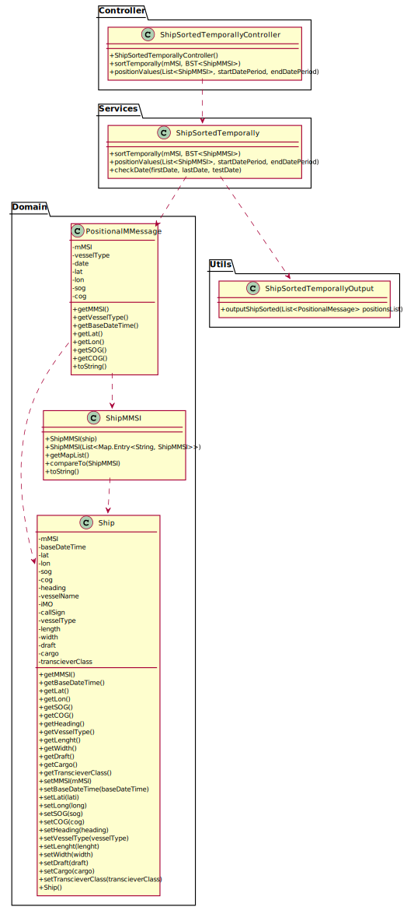

#ALL USER STORIES 

#US101-Import ships from a text file into a BST
## 1. Requirements Engineering

### 1.1. User Story Description
 As a traffic manager, I which to import ships from a text file into a BST.

### 1.2. Acceptance Criteria

* **AC1:** No data lost.

### System Sequence Diagram (SSD)

## Sequence Diagram (SD)

## Class Diagram (CD)

# 2. Tests 

## Class ReadShipsControllerTest
   
**Test to see if the tree is empty**
    
    @Test
    public void treeIsEmpty() {
        boolean a = ShipsTreeController.getInstance().getBSTByCallSign().isEmpty();
        boolean b = ShipsTreeController.getInstance().getBSTByShipMMSI().isEmpty();
        boolean c = ShipsTreeController.getInstance().getBSTByShipIMO().isEmpty();
        assertTrue(a, "Should be empty");
        assertTrue(b, "Should be empty");
        assertTrue(c, "Should be empty");

        try {
            readFilesController.load();
        } catch (Exception e) {
            throw new IllegalArgumentException("Error loading the file");
        }

        System.out.println("Tree MMSI SIZE: " + ShipsTreeController.getInstance().getBSTByShipMMSI().size());
        System.out.println();
        for (ShipMMSI s : ShipsTreeController.getInstance().getBSTByShipMMSI().inOrder()) {
            System.out.println(s.getMapList());
        }
        System.out.println();
        System.out.println(ShipsTreeController.getInstance().getBSTByShipIMO().size());
        System.out.println("Tree IMO SIZE: " + ShipsTreeController.getInstance().getBSTByShipIMO().size());
        System.out.println();
        for (ShipIMO s : ShipsTreeController.getInstance().getBSTByShipIMO().inOrder()) {
            System.out.println(s.getMapList());
        }
        System.out.println();
        System.out.println("Tree Call Sign: " + ShipsTreeController.getInstance().getBSTByCallSign().size());
        System.out.println();
        for (ShipCallSign s : ShipsTreeController.getInstance().getBSTByCallSign().inOrder()) {
            System.out.println(s.getMapList());
        }

        boolean d = ShipsTreeController.getInstance().getBSTByCallSign().isEmpty();
        boolean e = ShipsTreeController.getInstance().getBSTByShipMMSI().isEmpty();
        boolean f = ShipsTreeController.getInstance().getBSTByShipIMO().isEmpty();
        assertFalse(d, "Shouldn't be empty");
        assertFalse(e, "Shouldn't be empty");
        assertFalse(f, "Shouldn't be empty");

    }

**Test for the tree size**
    
    @Test
    public void treeSize() {
        readFilesController.load();

        if (!ReadShipsController.isUseBigFiles()) {
            assertEquals(22, ShipsTreeController.getInstance().getBSTByShipMMSI().size());
            assertEquals(22, ShipsTreeController.getInstance().getBSTByShipIMO().size());
            assertEquals(22, ShipsTreeController.getInstance().getBSTByCallSign().size());

        } else {
            assertEquals(133, ShipsTreeController.getInstance().getBSTByShipMMSI().size());
            assertEquals(133, ShipsTreeController.getInstance().getBSTByShipIMO().size());
            assertEquals(133, ShipsTreeController.getInstance().getBSTByCallSign().size());
        }
    }

# 3. Construction (Implementation)

## Class ReadShipsController

    public class ReadShipsController {
        private static final String FILE_SHIPS_BIG = "data-ships&ports//bships.csv";
        private static final String FILE_SHIPS_SMALL = "data-ships&ports//sships.csv";
        private static final boolean USE_BIG_FILES = false;
    
        public ReadShipsController() {
        }
    
        public void load() {
            try {
                System.out.println("========================================" + "\n|------ Start Loading File Info --------|");
    
                readShips();
    
                System.out.println("|- End Loading Files Info With Success -|" + "\n========================================");
    
            } catch (Exception ex) {
                ex.printStackTrace();
                //   System.out.println("File localization is invalid!");
    
            }
        }
    
        private void readShips() throws FileNotFoundException, ParseException {
            String[] aux;
            Scanner sc = new Scanner(new FileReader((USE_BIG_FILES ? FILE_SHIPS_BIG : FILE_SHIPS_SMALL)));
            sc.nextLine();
            while (sc.hasNextLine()) {
                String linha = sc.nextLine();
                if (linha != null) {
                    aux = linha.split(",");
                    ShipsTreeController.getInstance().creatShipTree(Integer.parseInt(aux[0]), new SimpleDateFormat("dd/MM/yyyy HH:mm").parse(aux[1]), checkLat(aux[2]), checkLon(aux[3]), Double.parseDouble(aux[4]), Double.parseDouble(aux[5]), checkHeading(aux[6]), aux[7], aux[8], aux[9], Integer.parseInt(aux[10]), Integer.parseInt(aux[11]), Integer.parseInt(aux[12]), Double.parseDouble(aux[13]), checkCargo(aux[14]), aux[15]);
                }
            }
            sc.close();
            ShipsTreeController.getInstance().creatShipTree(111111111, new Date(), 54.27664, -164.10602, 9.3, -133, 276, "CONTI LYON", "IMO0000000", "NULL", 79, 300, 40, 9.2, 79, "B");
            System.out.println("The Ships File has been read");
        }
    
        public Integer checkCargo(String cargo) {
            if (cargo.equals("NA")) {
                return 0;
            } else return Integer.parseInt(cargo);
        }
    
    
        public Double checkLat(String lat) {
            //[-90,90]
            double lati = Double.parseDouble(lat);
            if (lati < -90) {
                return -90.0;
            } else if (lati > 90) {
                return 90.0;
            }
            return lati;
        }
    
    
        public Double checkLon(String lon) {
            //[-180,180]
            double longi = Double.parseDouble(lon);
            if (longi < -180) {
                return -180.0;
            } else if (longi > 180) {
                return 180.0;
            }
            return longi;
        }
    
    
        public int checkHeading(String head) {
            //[0,359]
            int heady = Integer.parseInt(head);
            if (heady < 0) {
                return 0;
            } else if (heady > 359) {
                return 359;
            }
            return heady;
        }
    
        public static boolean isUseBigFiles() {
            return USE_BIG_FILES;
        }
    }

# US 102 - Search the details of a ship using any of its codes, MMSI, IMO or Call Sign

## 1. Requirements Engineering

### 1.1. User Story Description

As a traffic manager I which to search the details of a ship using any of its codes: 
MMSI, IMO or Call Sign. 

### 1.2. Acceptance Criteria

* **AC1:** MMSI: unique 9-digit ship identification code.
* **AC2:** IMO: unique 7-digit international identification number, which remains 
           unchanged after transferring the ship's registration to another country.
* **AC3:** Call sign: ship's unique callsign. 
* **AC4:** Correct use of OOP concepts.

### System Sequence Diagram (SSD)

## Sequence Diagram (SD)

## Class Diagram (CD)

# 2. Tests 

## Class ShipDetailsTest
 **Test to get the ship details with the MMSI for sships and bships file**
   
    @Test
       public void getShipDetailsMMSI() {
           readFilesController.load();
           String a = shipDetails.getShipDetailsMMSI(228339600, ShipsTreeController.getInstance().getBSTByShipMMSI());
           String b = "\nMMSI: " + 228339600 +
                   " \nIMO: " + "IMO9450648" +
                   " \nCALL SIGN: " + "FLSU" +
                   "\nVESSEL NAME: " + "CMA CGM ALMAVIVA" +
                   " \nVESSEL TYPE: " + 70 +
                   " \nLENGHT: " + 334 +
                   " \nWIDTH: " + 42 +
                   " \nDRAFT: " + 15.0 +
                   " \nCARGO:" + 79 +
                   " \nTRANSCEIVER CLASS: " + "B" +
                   "\n--//--";
           assertEquals(a, b);
       }

# 3. Construction (Implementation)

 ## Class ShipDetails
    public class ShipDetails {
 
     /**
      *
      * Gets ship details with mmsi code.
      *
      * @param mMSI     the m msi
      * @param listMMSI the list mmsi
      * @return the ship details mmsi
      */
     public String getShipDetailsMMSI(int mMSI, BST<ShipMMSI> listMMSI) {
         List<ShipMMSI> list = new LinkedList<>();
         List<Map.Entry<Integer, ShipMMSI>> shipMMSIList = new LinkedList<>();
         for (ShipMMSI s : listMMSI.inOrder()) {
             shipMMSIList.addAll(s.getMapList());
         }
 
         for (Map.Entry<Integer, ShipMMSI> s : shipMMSIList) {
             if (s.getKey() == mMSI) {
                 list.add(s.getValue());
             }
         }
 
         if (list.isEmpty()) {
             System.out.println("There is no ship with that MMSI");
             return null;
         }
         System.out.println();
         System.out.println("SHIP DETAILS:  ");
         String details = "\nMMSI: " + list.get(0).getmMSI() +
                 " \nIMO: " + list.get(0).getiMO() +
                 " \nCALL SIGN: " + list.get(0).getCallSign() +
                 "\nVESSEL NAME: " + list.get(0).getVesselName() +
                 " \nVESSEL TYPE: " + list.get(0).getVesselType() +
                 " \nLENGHT: " + list.get(0).getLength() +
                 " \nWIDTH: " + list.get(0).getWidth() +
                 " \nDRAFT: " + list.get(0).getDraft() +
                 " \nCARGO:" + list.get(0).getCargo() +
                 " \nTRANSCEIVER CLASS: " + list.get(0).getTranscieverClass() +
                 "\n--//--";
         System.out.println(details);
         System.out.println();
         ShipDetailsOutput.outPutDetails(details);
         return details;
     }
 
     /**
      * Gets ship details with imo code.
      *
      * @param iMO     the mo
      * @param listIMO the list imo
      * @return the ship details imo
      */
     public String getShipDetailsIMO(String iMO, BST<ShipIMO> listIMO) {
 
         List<ShipIMO> list = new LinkedList<>();
         List<Map.Entry<String, ShipIMO>> shipIMOList = new LinkedList<>();
         for (ShipIMO s : listIMO.inOrder()) {
             shipIMOList.addAll(s.getMapList());
         }
 
         for (Map.Entry<String, ShipIMO> s : shipIMOList) {
             if (s.getKey().equals(iMO)) {
                 list.add(s.getValue());
             }
         }
 
         if (list.isEmpty()) {
             System.out.println("There is no ship with that IMO");
             return null;
         }
         System.out.println();
         System.out.println("SHIP DETAILS:    ");
         String details = "\nMMSI: " + list.get(0).getmMSI() +
                 " \nIMO: " + list.get(0).getiMO() +
                 " \nCALL SIGN: " + list.get(0).getCallSign() +
                 "\nVESSEL NAME: " + list.get(0).getVesselName() +
                 " \nVESSEL TYPE: " + list.get(0).getVesselType() +
                 " \nLENGHT: " + list.get(0).getLength() +
                 " \nWIDTH: " + list.get(0).getWidth() +
                 " \nDRAFT: " + list.get(0).getDraft() +
                 " \nCARGO:" + list.get(0).getCargo() +
                 " \nTRANSCEIVER CLASS: " + list.get(0).getTranscieverClass() +
                 "\n--//--";
         System.out.println(details);
         ShipDetailsOutput.outPutDetails(details);
         return details;
     }
 
     /**
      * Gets ship details with call sign.
      *
      * @param callSign     the call sign
      * @param listCallSign the list call sign
      * @return the ship details call sign
      */
     public String getShipDetailsCallSign(String callSign, BST<ShipCallSign> listCallSign) {
 
         List<ShipCallSign> list = new LinkedList<>();
         List<Map.Entry<String, ShipCallSign>> shipCallSignList = new LinkedList<>();
         for (ShipCallSign s : listCallSign.inOrder()) {
             shipCallSignList.addAll(s.getMapList());
         }
 
         for (Map.Entry<String, ShipCallSign> s : shipCallSignList) {
             if (s.getKey().equals(callSign)) {
                 list.add(s.getValue());
             }
         }
 
         if (list.isEmpty()) {
             System.out.println("There is no ship with that Call Sign");
             return null;
         }
         System.out.println();
         System.out.println("SHIP DETAILS:    ");
         String details = "\nMMSI: " + list.get(0).getmMSI() +
                 " \nIMO: " + list.get(0).getiMO() +
                 " \nCALL SIGN: " + list.get(0).getCallSign() +
                 "\nVESSEL NAME: " + list.get(0).getVesselName() +
                 " \nVESSEL TYPE: " + list.get(0).getVesselType() +
                 " \nLENGHT: " + list.get(0).getLength() +
                 " \nWIDTH: " + list.get(0).getWidth() +
                 " \nDRAFT: " + list.get(0).getDraft() +
                 " \nCARGO:" + list.get(0).getCargo() +
                 " \nTRANSCEIVER CLASS: " + list.get(0).getTranscieverClass() +
                 "\n--//--";
         System.out.println(details);
         ShipDetailsOutput.outPutDetails(details);
         return details;
     }
     
# US 103 - Positional messages temporally organized and associated with each of the ships

## 1. Requirements Engineering
### 1.1. User Story Description

As a traffic manager I which to have the positional messages temporally organized and associated with each of the ships

### 1.2. Acceptance Criteria
* **AC1:** Efficient access of any position value(s) of a ship on a period or date. 

### System Sequence Diagram (SSD)

## Sequence Diagram (SD)

## Class Diagram (CD)

# 2. Tests 

## Class ShipSortedTest
 **Test to sort the list of seme MMSI code ships temporally**
   
    @Test
       void sortTemporally() throws ParseException {
           readFilesController.load();
           List<ShipMMSI> list1 = shipSortedTemporally.sortTemporally(212180000, ShipsTreeController.getInstance().getBSTByShipMMSI());
   
           List<ShipMMSI> list = new LinkedList<>();
           Ship ship1 = new Ship(212180000, new SimpleDateFormat("dd/MM/yyyy HH:mm").parse("31/12/2020 19:37"), 24.34573, -85.12394, 11.7, 119.9, 117, "SAITA I", "IMO9643544", "5BBA4", 70, 228, 32, 14.4, 0, "A");
           Ship ship2 = new Ship(212180000, new SimpleDateFormat("dd/MM/yyyy HH:mm").parse("31/12/2020 20:17"), 24.28016, -85.00316, 11.3, 120.8, 118, "SAITA I", "IMO9643544", "5BBA4", 70, 228, 32, 14.4, 0, "B");
           Ship ship3 = new Ship(212180000, new SimpleDateFormat("dd/MM/yyyy HH:mm").parse("31/12/2020 21:07"), 24.20221, -84.85411, 11.3, 116.8, 117, "SAITA I", "IMO9643544", "5BBA4", 70, 228, 32, 14.4, 0, "A");
           Ship ship4 = new Ship(212180000, new SimpleDateFormat("dd/MM/yyyy HH:mm").parse("31/12/2020 21:49"), 24.14301, -84.72268, 11.7, 116.6, 114, "SAITA I", "IMO9643544", "5BBA4", 70, 228, 32, 14.4, 0, "B");
           Ship ship5 = new Ship(212180000, new SimpleDateFormat("dd/MM/yyyy HH:mm").parse("31/12/2020 22:10"), 24.11445, -84.65529, 11.6, 113.3, 110, "SAITA I", "IMO9643544", "5BBA4", 70, 228, 32, 14.4, 0, "B");
   
           ShipMMSI shipA1 = new ShipMMSI(ship1);
           ShipMMSI shipA2 = new ShipMMSI(ship2);
           ShipMMSI shipA3 = new ShipMMSI(ship3);
           ShipMMSI shipA4 = new ShipMMSI(ship4);
           ShipMMSI shipA5 = new ShipMMSI(ship5);
   
           list.add(shipA1);
           list.add(shipA2);
           list.add(shipA3);
           list.add(shipA4);
           list.add(shipA5);
   
           assertEquals(list,list1);
       }

 **Test to see the position value of a certain ship in a period of time, organized temporally**
    
    @Test
    void positionValues() throws ParseException {
        readFilesController.load();
        List<ShipMMSI> list = new LinkedList<>();
        Ship ship1 = new Ship(212180000, new SimpleDateFormat("dd/MM/yyyy HH:mm").parse("31/12/2020 19:37"), 24.34573, -85.12394, 11.7, 119.9, 117, "SAITA I", "IMO9643544", "5BBA4", 70, 228, 32, 14.4, 0, "A");
        Ship ship2 = new Ship(212180000, new SimpleDateFormat("dd/MM/yyyy HH:mm").parse("31/12/2020 20:17"), 24.28016, -85.00316, 11.3, 120.8, 118, "SAITA I", "IMO9643544", "5BBA4", 70, 228, 32, 14.4, 0, "B");
        Ship ship3 = new Ship(212180000, new SimpleDateFormat("dd/MM/yyyy HH:mm").parse("31/12/2020 21:07"), 24.20221, -84.85411, 11.3, 116.8, 117, "SAITA I", "IMO9643544", "5BBA4", 70, 228, 32, 14.4, 0, "A");
        Ship ship4 = new Ship(212180000, new SimpleDateFormat("dd/MM/yyyy HH:mm").parse("31/12/2020 21:49"), 24.14301, -84.72268, 11.7, 116.6, 114, "SAITA I", "IMO9643544", "5BBA4", 70, 228, 32, 14.4, 0, "B");
        Ship ship5 = new Ship(212180000, new SimpleDateFormat("dd/MM/yyyy HH:mm").parse("31/12/2020 22:10"), 24.11445, -84.65529, 11.6, 113.3, 110, "SAITA I", "IMO9643544", "5BBA4", 70, 228, 32, 14.4, 0, "B");

        ShipMMSI shipA1 = new ShipMMSI(ship1);
        ShipMMSI shipA2 = new ShipMMSI(ship2);
        ShipMMSI shipA3 = new ShipMMSI(ship3);
        ShipMMSI shipA4 = new ShipMMSI(ship4);
        ShipMMSI shipA5 = new ShipMMSI(ship5);

        list.add(shipA1);
        list.add(shipA2);
        list.add(shipA3);
        list.add(shipA4);
        list.add(shipA5);
        List<PositionalMessage> positiontest = new LinkedList<>();
        PositionalMessage a= new PositionalMessage(212180000,70,11.7,119.9,new SimpleDateFormat("dd/MM/yyyy HH:mm").parse("31/12/2020 19:37"),24.34573,-85.12394);
        PositionalMessage b= new PositionalMessage(212180000,70,11.3,120.8,new SimpleDateFormat("dd/MM/yyyy HH:mm").parse("31/12/2020 20:17"),24.28016,-85.00316);
        PositionalMessage c= new PositionalMessage(212180000,70,11.3,116.8,new SimpleDateFormat("dd/MM/yyyy HH:mm").parse("31/12/2020 21:07"),24.20221,-84.85411);
        positiontest.add(a);
        positiontest.add(b);
        positiontest.add(c);
        List<PositionalMessage> actualPositions = shipSortedTemporally.positionValues(list, new SimpleDateFormat("dd/MM/yyyy HH:mm").parse("31/12/2020 19:30"), new SimpleDateFormat("dd/MM/yyyy HH:mm").parse("31/12/2020 21:30"));
        assertEquals(positiontest.toString(), actualPositions.toString());
    }

# 3. Construction (Implementation)

 ## Class ShipSortedTemporally
  
    public class ShipSortedTemporally {
   
       public List<ShipMMSI> sortTemporally(int mMSI, BST<ShipMMSI> listTree) {
           List<ShipMMSI> list = new LinkedList<>();
           List<Map.Entry<Integer, ShipMMSI>> shipMMSIList = new LinkedList<>();
           for (ShipMMSI s : listTree.inOrder()) {
               shipMMSIList.addAll(s.getMapList());
           }
   
           for (Map.Entry<Integer, ShipMMSI> s : shipMMSIList) {
               if (s.getKey() == mMSI) {
                   list.add(s.getValue());
               }
           }
   
           if (list.isEmpty()) {
               System.out.println("There is no ship with that MMSI");
               return null;
           }
           list.sort(Comparator.comparing(ShipMMSI::getBaseDateTime));
           return list;
       }
   
       public List<PositionalMessage> positionValues(List<ShipMMSI> list, Date startDatePeriod, Date endDatePeriod){
           List<PositionalMessage> positionsList = new LinkedList<>();
           for (ShipMMSI shipMMSI : list) {
               if (checkDate(startDatePeriod, endDatePeriod, shipMMSI.getBaseDateTime())) {
                   PositionalMessage positionValue = new PositionalMessage(shipMMSI.getmMSI(), shipMMSI.getVesselType(), shipMMSI.getsOG(), shipMMSI.getcOG(), shipMMSI.getBaseDateTime(), shipMMSI.getlAT(), shipMMSI.getlON());
                   positionsList.add(positionValue);
               }
           }
           if (positionsList.isEmpty()){
               System.out.println("There aren't any postional values for this ship during the selected time period");
               return null;
           } else
               ShipSortedTemporallyOutput.outputShipSorted(positionsList);
               return positionsList;
       }
       /**
        * Check date boolean.
        *
        * @param first    the first
        * @param last     the last
        * @param testDate the test date
        * @return the boolean
        */
       public boolean checkDate(Date first, Date last, Date testDate) {
           return first.before(testDate)
                   && last.after(testDate);
       }
     }

     

     
  # US 104 -Make a Summary of a ship's movements.
          
  ## 1. Requirements Engineering
          
  ### 1.1. User Story Description
  As a traffic manager I which to make a Summary of a ship's movements.
  ### 1.2. Acceptance Criteria
  * **AC1:** For a given ship return in an appropriate structure one of its codes (MMSI, IMO or Call Sign), Vessel Name, Start Base  Date Time, End 
             Base Date Time, Total Movement Time, Total Number of Movements, Max SOG, Mean SOG, Max COG, Mean COG, Departure Latitude, 
             Departure Longitude, Arrival Latitude, Arrival Longitude, Travelled Distance (incremental sum of the distance between each positioning 
             message) and Delta Distance (linear distance between the coordinates of the first and last move).
  
     
  ### System Sequence Diagram (SSD)     
   
     
  ## Sequence Diagram (SD)
  
          
   ## Class Diagram (CD)
          
   
          
   # 2. Tests 
   ## Class ShipResumeTest
  **Test to get  the ship resume for sships and bships file**
              
        @Test
            void getShipResume() throws ParseException {
        
                readFilesController.load();
                if (!ReadShipsController.isUseBigFiles()) {
                    String a = shipResume.getShipResume(228339600, ShipsTreeController.getInstance().getBSTByShipMMSI());
                    String b = String.format("MMSI:%s%nIMO:%s%nCall Sign:%s%nVessel Name:%s%nStart Base Date Time:%s%nEnd Base Date Time:%s%nTotal Movements Time:%s%nTotal Number Of Movements:%s%nMax SOG:%s%nMean SOG:%s%nMax COG:%s%nMean COG:%s%nDeparture Latitude:%s%nDeparture Longitude:%s%nArrival Latitude:%s%nArrival Longitude:%s%nTravelled Distance:%s%nDelta Distance:%s%n ", 228339600, "IMO9450648", "FLSU", "CMA CGM ALMAVIVA", new SimpleDateFormat("dd/MM/yyyy HH:mm").parse("31/12/2020 00:00"), new SimpleDateFormat("dd/MM/yyyy HH:mm").parse("31/12/2020 3:56"), 236, 18, 12.0, 11.732, 131.1, 129.037, 28.37458, -88.88584, 27.87869, -88.88584, 85.261, 85.222);
                    assertEquals(a, b);
        
                    String c = shipResume.getShipResume(212351000, ShipsTreeController.getInstance().getBSTByShipMMSI());
                    String d = String.format("MMSI:%s%nIMO:%s%nCall Sign:%s%nVessel Name:%s%nStart Base Date Time:%s%nEnd Base Date Time:%s%nTotal Movements Time:%s%nTotal Number Of Movements:%s%nMax SOG:%s%nMean SOG:%s%nMax COG:%s%nMean COG:%s%nDeparture Latitude:%s%nDeparture Longitude:%s%nArrival Latitude:%s%nArrival Longitude:%s%nTravelled Distance:%s%nDelta Distance:%s%n ", 212351000, "IMO9305685", "5BZP3", "HYUNDAI SINGAPORE", new SimpleDateFormat("dd/MM/yyyy HH:mm").parse("31/12/2020 23:03"), new SimpleDateFormat("dd/MM/yyyy HH:mm").parse("31/12/2020 23:03"), 0, 0, 3.5, 3.5, -61.6, -61.6, 55.09307, -167.63625, 55.09307, -167.63625, 0.0, 0.0);
                    assertEquals(c, d);
                } else {
                    String a = shipResume.getShipResume(441188000, ShipsTreeController.getInstance().getBSTByShipMMSI());
                    String b = String.format("MMSI:%s%nIMO:%s%nCall Sign:%s%nVessel Name:%s%nStart Base Date Time:%s%nEnd Base Date Time:%s%nTotal Movements Time:%s%nTotal Number Of Movements:%s%nMax SOG:%s%nMean SOG:%s%nMax COG:%s%nMean COG:%s%nDeparture Latitude:%s%nDeparture Longitude:%s%nArrival Latitude:%s%nArrival Longitude:%s%nTravelled Distance:%s%nDelta Distance:%s%n ", 441188000, "IMO9651113", "D8GS", "GLOVIS CHAMPION", new SimpleDateFormat("dd/MM/yyyy HH:mm").parse("31/12/2020 00:00"), new SimpleDateFormat("dd/MM/yyyy HH:mm").parse("31/12/2020 22:20"), 1340, 624, 18.5, 13.328, 201.4, -77.909, 26.67097, -79.4351, 30.94004, -79.4351, 557.372, 503.309);
                    assertEquals(a, b);
        
                    String c = shipResume.getShipResume(366904930, ShipsTreeController.getInstance().getBSTByShipMMSI());
                    String d = String.format("MMSI:%s%nIMO:%s%nCall Sign:%s%nVessel Name:%s%nStart Base Date Time:%s%nEnd Base Date Time:%s%nTotal Movements Time:%s%nTotal Number Of Movements:%s%nMax SOG:%s%nMean SOG:%s%nMax COG:%s%nMean COG:%s%nDeparture Latitude:%s%nDeparture Longitude:%s%nArrival Latitude:%s%nArrival Longitude:%s%nTravelled Distance:%s%nDelta Distance:%s%n ", 366904930, "IMO5148417", "WL3972", "HERBERT C JACKSON", new SimpleDateFormat("dd/MM/yyyy HH:mm").parse("31/12/2020 00:00"), new SimpleDateFormat("dd/MM/yyyy HH:mm").parse("31/12/2020 22:59"), 1379, 1202, 12.8, 11.484, 50.1, -50.565, 42.5556, -82.58517, 46.37353, -82.58517, 491.848, 443.804);
                    assertEquals(c, d);
                }
            }
          
   **Test to fet number of movements**
       
         @Test
            void getNumberOfMovements() throws ParseException {
                List<ShipMMSI> list = new LinkedList<>();
                Ship ship1 = new Ship(210950000, new SimpleDateFormat("dd/MM/yyyy HH:mm").parse("31/12/2020 17:19"), 42.97875, -66.97001, 12.9, 13.1, 355, "VARAMO", "IMO9395044", "C4SQ2", 70, 166, 25, 9.5, 76, "B");
                Ship ship2 = new Ship(210950000, new SimpleDateFormat("dd/MM/yyyy HH:mm").parse("31/12/2020 17:03"), 42.92236, -66.97243, 12.5, 2.4, 358, "VARAMO", "IMO9395044", "C4SQ2", 70, 166, 25, 9.5, 34, "B");
                Ship ship3 = new Ship(210950000, new SimpleDateFormat("dd/MM/yyyy HH:mm").parse("31/12/2020 17:04"), 42.7698, -66.9759, 13.3, 3.7, 356, "VARAMO", "IMO9395044", "C4SQ2", 70, 166, 25, 9.5, 22, "B");
                Ship ship4 = new Ship(210950000, new SimpleDateFormat("dd/MM/yyyy HH:mm").parse("31/12/2020 17:16"), 42.7698, -66.9759, 12.7, -55.4, 358, "VARAMO", "IMO9395044", "C4SQ2", 70, 166, 25, 9.5, 21, "B");
                Ship ship5 = new Ship(210950000, new SimpleDateFormat("dd/MM/yyyy HH:mm").parse("1/01/2021 17:16"), 42.96912, -66.9759, 15, 35.4, 358, "VARAMO", "IMO9395044", "C4SQ2", 70, 166, 25, 9.5, 21, "B");
                Ship ship6 = new Ship(210950000, new SimpleDateFormat("dd/MM/yyyy HH:mm").parse("1/01/2021 17:17"), 42.96912, -66.9755, 15, 35.4, 358, "VARAMO", "IMO9395044", "C4SQ2", 70, 166, 25, 9.5, 21, "B");
        
                ShipMMSI shipA1 = new ShipMMSI(ship1);
                ShipMMSI shipA2 = new ShipMMSI(ship2);
                ShipMMSI shipA3 = new ShipMMSI(ship3);
                ShipMMSI shipA4 = new ShipMMSI(ship4);
                ShipMMSI shipA5 = new ShipMMSI(ship5);
                ShipMMSI shipA6 = new ShipMMSI(ship6);
        
                list.add(shipA1);
                list.add(shipA2);
                list.add(shipA3);
        
                int expected = shipResume.getTotalNumberOfMovements(list);
                assertEquals(2, expected);
        
                list.add(shipA4);
                int expected2 = shipResume.getTotalNumberOfMovements(list);
                assertEquals(2, expected2);
        
                list.add(shipA5);
                int expected3 = shipResume.getTotalNumberOfMovements(list);
                assertEquals(3, expected3);
        
                list.add(shipA6);
                int expected4 = shipResume.getTotalNumberOfMovements(list);
                assertEquals(4, expected4);
            }
   **Test to get the travelled distance**
          
           @Test
              void getTravelDistance() throws ParseException {
                  List<ShipMMSI> list = new LinkedList<>();
                  Ship ship1 = new Ship(210950000, new SimpleDateFormat("dd/MM/yyyy HH:mm").parse("31/12/2020 17:19"), 42.97875, -66.97001, 12.9, 13.1, 355, "VARAMO", "IMO9395044", "C4SQ2", 70, 166, 25, 9.5, 76, "B");
                  Ship ship2 = new Ship(210950000, new SimpleDateFormat("dd/MM/yyyy HH:mm").parse("31/12/2020 17:03"), 42.92236, -66.97243, 12.5, 2.4, 358, "VARAMO", "IMO9395044", "C4SQ2", 70, 166, 25, 9.5, 34, "B");
                  Ship ship3 = new Ship(210950000, new SimpleDateFormat("dd/MM/yyyy HH:mm").parse("31/12/2020 16:20"), 42.7698, -66.9759, 13.3, 3.7, 356, "VARAMO", "IMO9395044", "C4SQ2", 70, 166, 25, 9.5, 22, "B");
                  Ship ship4 = new Ship(210950000, new SimpleDateFormat("dd/MM/yyyy HH:mm").parse("03/01/2021 17:16"), 42.96912, -66.97061, 12.7, -55.4, 358, "VARAMO", "IMO9395044", "C4SQ2", 70, 166, 25, 9.5, 21, "B");
                  ShipMMSI shipA1 = new ShipMMSI(ship1);
                  ShipMMSI shipA2 = new ShipMMSI(ship2);
                  ShipMMSI shipA3 = new ShipMMSI(ship3);
                  ShipMMSI shipA4 = new ShipMMSI(ship4);
                  list.add(shipA1);
                  list.add(shipA2);
          
                  double actual1 = shipResume.getTravelDistance(list);
                  double expected1 = DistanceBetweenTwoPointsCalculator.distance(ship2.getlAT(), ship1.getlAT(), ship2.getlON(), ship1.getlON());
                  assertEquals(expected1, actual1);
          
                  list.add(shipA3);
                  double actual2 = shipResume.getTravelDistance(list);
                  double expected2 = DistanceBetweenTwoPointsCalculator.distance(ship3.getlAT(), ship2.getlAT(), ship3.getlON(), ship2.getlON()) + DistanceBetweenTwoPointsCalculator.distance(ship2.getlAT(), ship1.getlAT(), ship2.getlON(), ship1.getlON());
                  assertEquals(actual2, expected2);
          
                  list.add(shipA4);
                  double actual3 = shipResume.getTravelDistance(list);
                  double expected3 = DistanceBetweenTwoPointsCalculator.distance(ship3.getlAT(), ship2.getlAT(), ship3.getlON(), ship2.getlON()) + DistanceBetweenTwoPointsCalculator.distance(ship2.getlAT(), ship1.getlAT(), ship2.getlON(), ship1.getlON()) + DistanceBetweenTwoPointsCalculator.distance(ship1.getlAT(), ship4.getlAT(), ship1.getlON(), ship4.getlON());
                  assertEquals(actual3, expected3);
              }

   # 3. Construction (Implementation)
          
   ## Class ShipResume
        public class ShipResume {
        
        
            public String getShipResume(int mMSI, BST<ShipMMSI> listTree) {
                List<ShipMMSI> list = new LinkedList<>();
                List<Map.Entry<Integer, ShipMMSI>> shipMMSIList = new LinkedList<>();
                for (ShipMMSI s : listTree.inOrder()) {
                    shipMMSIList.addAll(s.getMapList());
                }
        
                for (Map.Entry<Integer, ShipMMSI> s : shipMMSIList) {
                    if (s.getKey() == mMSI) {
                        list.add(s.getValue());
                    }
                }
        
                if (list.isEmpty()) {
                    System.out.println("There is no ship with that MMSI");
                    return null;
                }
                System.out.println("\n\n===============================================");
                System.out.println("===============Ship Resume=====================");
                System.out.println("===============================================\n");
                String s = String.format("MMSI:%s%nIMO:%s%nCall Sign:%s%nVessel Name:%s%nStart Base Date Time:%s%nEnd Base Date Time:%s%nTotal Movements Time:%s%nTotal Number Of Movements:%s%nMax SOG:%s%nMean SOG:%s%nMax COG:%s%nMean COG:%s%nDeparture Latitude:%s%nDeparture Longitude:%s%nArrival Latitude:%s%nArrival Longitude:%s%nTravelled Distance:%s%nDelta Distance:%s%n ",
                        list.get(0).getmMSI(), list.get(0).getiMO(), list.get(0).getCallSign(), list.get(0).getVesselName(), getBaseDateTimeInicial(list),
                        getBaseDateTimeFinal(list), getTotalMovementTime(list), getTotalNumberOfMovements(list), getMaxSOG(list), getMeanSOG(list), getMaxCOG(list),
                        getMeanCOG(list), getDepartureLatitude(list), getDepartureLongitude(list), getArrivalLatitude(list), getDepartureLongitude(list),
                        getTravelDistance(list), getDeltaDistance(list));
                System.out.println(s);
                System.out.println("===============================================");
                ShipResumeSystem.outPutResume(s, mMSI);
                return s;
            }
        
        
            public Date getBaseDateTimeInicial(List<ShipMMSI> list) {
                list.sort(Comparator.comparing(ShipMMSI::getBaseDateTime));
        
                return list.get(0).getBaseDateTime();
            }
        
            public Date getBaseDateTimeFinal(List<ShipMMSI> list) {
                list.sort((o1, o2) -> o2.getBaseDateTime().compareTo(o1.getBaseDateTime()));
                return list.get(0).getBaseDateTime();
            }
        
            public long getTotalMovementTime(List<ShipMMSI> shipList) {
                Date date1 = getBaseDateTimeInicial(shipList);
                Date date2 = getBaseDateTimeFinal(shipList);
        
                return DiferenceBetweenToDates.findDifference(date1, date2);
            }
        
            public int getTotalNumberOfMovements(List<ShipMMSI> list) {
                int numMovements = 0;
                list.sort(Comparator.comparing(Ship::getBaseDateTime));
                for (int i = 0; i < list.size() - 1; i++) {
                    if (list.get(i).getlAT() != list.get(i + 1).getlAT() || list.get(i).getlON() != list.get(i + 1).getlON()) {
                        numMovements++;
                    }
                }
                return numMovements;
            }
        
            public double getMaxSOG(List<ShipMMSI> lShip) {
                List<Map.Entry<ShipMMSI, Double>> resultMapList = new LinkedList<>();
                for (ShipMMSI ship : lShip) {
                    if (!containShip(ship.getmMSI(), resultMapList)) {
                        Map<ShipMMSI, Double> shipMap = new HashMap<>();
                        shipMap.put(ship, ship.getsOG());
                        resultMapList.addAll(shipMap.entrySet());
                    } else {
                        if (resultMapList.get(0).getValue() < ship.getsOG()) {
                            resultMapList.get(0).setValue(ship.getsOG());
                        }
                    }
                }
                return resultMapList.get(0).getValue();
            }
        
            public double getMeanSOG(List<ShipMMSI> lShip) {
                List<Map.Entry<ShipMMSI, Double>> resultMapList = new LinkedList<>();
                double sog = 0;
                for (ShipMMSI ship : lShip) {
                    if (!containShip(ship.getmMSI(), resultMapList)) {
                        Map<ShipMMSI, Double> shipMap = new HashMap<>();
                        sog = ship.getsOG();
                        shipMap.put(ship, sog);
                        resultMapList.addAll(shipMap.entrySet());
                    } else {
                        sog += ship.getsOG();
                        resultMapList.get(0).setValue(sog);
                    }
                }
        
                return BigDecimal.valueOf(sog / lShip.size()).setScale(3, RoundingMode.HALF_EVEN).doubleValue();
        
            }
        
            public double getMeanCOG(List<ShipMMSI> lShip) {
                List<Map.Entry<ShipMMSI, Double>> resultMapList = new LinkedList<>();
                double cog = 0;
                for (ShipMMSI ship : lShip) {
                    if (!containShip(ship.getmMSI(), resultMapList)) {
                        Map<ShipMMSI, Double> shipMap = new HashMap<>();
                        cog = ship.getcOG();
                        shipMap.put(ship, cog);
                        resultMapList.addAll(shipMap.entrySet());
                    } else {
                        cog += ship.getcOG();
                        resultMapList.get(0).setValue(cog);
                    }
                }
        
                return BigDecimal.valueOf(cog / lShip.size()).setScale(3, RoundingMode.HALF_EVEN).doubleValue();
        
            }
        
            public double getMaxCOG(List<ShipMMSI> lShip) {
                List<Map.Entry<ShipMMSI, Double>> listMap = new LinkedList<>();
                for (ShipMMSI ship : lShip) {
                    if (!containShip(ship.getmMSI(), listMap)) {
                        Map<ShipMMSI, Double> shipMap = new HashMap<>();
                        shipMap.put(ship, ship.getcOG());
                        listMap.addAll(shipMap.entrySet());
                    } else {
                        if (listMap.get(0).getValue() < ship.getcOG()) {
                            listMap.get(0).setValue(ship.getcOG());
                        }
                    }
                }
                return listMap.get(0).getValue();
            }
        
            public boolean containShip(int mMSI, List<Map.Entry<ShipMMSI, Double>> map) {
                for (Map.Entry<ShipMMSI, Double> mapR : map) {
                    if (mMSI == mapR.getKey().getmMSI()) {
                        return true;
                    }
                }
                return false;
            }
        
            public double getDepartureLatitude(List<ShipMMSI> list) {
                Date date = getBaseDateTimeInicial(list);
                for (ShipMMSI ship : list) {
                    if (ship.getBaseDateTime().equals(date))
                        return ship.getlAT();
                }
                return 0.0;
            }
        
            public double getDepartureLongitude(List<ShipMMSI> list) {
                Date date = getBaseDateTimeInicial(list);
                for (ShipMMSI ship : list) {
                    if (ship.getBaseDateTime().equals(date))
                        return ship.getlON();
                }
                return 0.0;
            }
        
            public double getArrivalLatitude(List<ShipMMSI> list) {
                Date date = getBaseDateTimeFinal(list);
                for (ShipMMSI ship : list) {
                    if (ship.getBaseDateTime().equals(date))
                        return ship.getlAT();
                }
                return 0.0;
            }
        
            public double getArrivalLongitude(List<ShipMMSI> list) {
                Date date = getBaseDateTimeFinal(list);
                for (ShipMMSI ship : list) {
                    if (ship.getBaseDateTime().equals(date))
                        return ship.getlON();
                }
                return 0.0;
            }
        
            public double getTravelDistance(List<ShipMMSI> shipList) {
                //(soma incremental da distância entre cada mensagem de posicionamento
                double incremental = 0;
                shipList.sort(Comparator.comparing(ShipMMSI::getBaseDateTime));
                for (int i = 0; i < shipList.size() - 1; i++) {
        
                    incremental += DistanceBetweenTwoPointsCalculator.distance(shipList.get(i).getlAT(), shipList.get(i + 1).getlAT(), shipList.get(i).getlON(), shipList.get(i + 1).getlON());
                }
                //BigDecimal.valueOf(incremental).setScale(3, RoundingMode.HALF_EVEN);
        
                return BigDecimal.valueOf(incremental).setScale(3, RoundingMode.HALF_EVEN).doubleValue();
        
            }
        
            public double getDeltaDistance(List<ShipMMSI> list) {
                //(distância linear entre as coordenadas do primeiro e último movimento)
                list.sort(Comparator.comparing(ShipMMSI::getBaseDateTime));
                Ship shipStart = list.get(0);
                list.sort((o1, o2) -> o2.getBaseDateTime().compareTo(o1.getBaseDateTime()));
                Ship shipArrive = list.get(0);
        
                return BigDecimal.valueOf(DistanceBetweenTwoPointsCalculator.distance(shipStart.getlAT(), shipArrive.getlAT(), shipStart.getlON(), shipArrive.getlON())).setScale(3, RoundingMode.HALF_EVEN).doubleValue();  //(distância linear entre as coordenadas do primeiro e último movimento)
            }
        }

     
     
     
  # US 105 -  List for all ships the MMSI, the total number of movements, Travelled Distance and Delta Distance.
     
  ## 1. Requirements Engineering
     
  ### 1.1. User Story Description
  As a traffic manager I which to list for all ships the MMSI, the total number of 
  movements, Travelled Distance and Delta Distance. 
     
  ### 1.2. Acceptance Criteria
  * **AC1:** MMSI: unique 9-digit ship identification code.
  * **AC2:** ordered by Travelled Distance and total number of movements (descending/ascending).

     
  ### System Sequence Diagram (SSD)     
  

 ## Sequence Diagram (SD)
  
     
 ## Class Diagram (CD)
     
 
     
 # 2. Tests 
 ## Class ListMMTDDDTest
 **Test to get a list of the type ShipAtrib from the type ShipMMSI for sships and bships file**
         
          @Test
          void allShips() {
              readFilesController.load();
              if (!ReadShipsController.isUseBigFiles()) {
                  List<ShipAtrib> list = new LinkedList<>();
                  ShipAtrib a = new ShipAtrib(210950000, 24, 58.875, 58.869);
                  ShipAtrib b = new ShipAtrib(212180000, 4, 54.076, 54.033);
                  ShipAtrib c = new ShipAtrib(212351000, 0, 0.0, 0.0);
                  ShipAtrib d = new ShipAtrib(228339600, 18, 85.261, 85.222);
                  ShipAtrib e = new ShipAtrib(229767000, 3, 75.787, 75.787);
                  ShipAtrib f = new ShipAtrib(229857000, 4, 2.555, 2.469);
                  ShipAtrib g = new ShipAtrib(229961000, 1, 0.023, 0.023);
                  ShipAtrib h = new ShipAtrib(235092459, 0, 0.0, 0.0);
                  ShipAtrib i = new ShipAtrib(249047000, 7, 0.093, 0.018);
                  ShipAtrib j = new ShipAtrib(256304000, 0, 0.0, 0.0);
                  ShipAtrib k = new ShipAtrib(256888000, 6, 13.525, 13.523);
                  ShipAtrib l = new ShipAtrib(257881000, 5, 78.959, 78.953);
                  ShipAtrib m = new ShipAtrib(258692000, 13, 33.255, 33.252);
                  ShipAtrib n = new ShipAtrib(303221000, 18, 0.053, 0.002);
                  ShipAtrib o = new ShipAtrib(303267000, 3, 0.003, 0.001);
                  ShipAtrib p = new ShipAtrib(305176000, 3, 1.527, 1.527);
                  ShipAtrib q = new ShipAtrib(305373000, 1, 138.595, 138.595);
                  ShipAtrib r = new ShipAtrib(305776000, 3, 6.543, 6.542);
                  ShipAtrib s = new ShipAtrib(309416000, 1, 0.072, 0.072);
                  ShipAtrib t = new ShipAtrib(636019825, 25, 12.159, 12.156);
                  ShipAtrib u = new ShipAtrib(636091400, 0, 0.0, 0.0);
                  ShipAtrib v = new ShipAtrib(636092932, 4, 0.019, 0.007);
     
        
                    list.add(a);list.add(b);list.add(c); list.add(d);  list.add(e);list.add(f);list.add(g); list.add(h);
                    list.add(i);list.add(j);list.add(k);list.add(l);list.add(m);list.add(n); list.add(o); list.add(p);
                    list.add(q);list.add(r);list.add(s);list.add(t);list.add(u)list.add(v);
                    
                    List<ShipAtrib> fg = new LinkedList<>(listMmsiMovTDDDController.listMmsiMovTDDD(ShipsTreeController.getInstance().getBSTByShipMMSI()));
                    System.out.println(fg);
                    assertEquals(list, fg);
                } else {
                    String list = "[\n" +
                            "MMSI:210950000 NUMBER OF MOVEMENTS:24 TRAVELLED DISTANCE:58.875 DELTA DISTANCE:58.869, \n" +
                            "MMSI:211331640 NUMBER OF MOVEMENTS:1220 TRAVELLED DISTANCE:597.419 DELTA DISTANCE:551.328, \n" +
                            "MMSI:212180000 NUMBER OF MOVEMENTS:4 TRAVELLED DISTANCE:54.076 DELTA DISTANCE:54.033, \n" +
                            "MMSI:212351000 NUMBER OF MOVEMENTS:0 TRAVELLED DISTANCE:0.0 DELTA DISTANCE:0.0, \n" +
                            "MMSI:228339600 NUMBER OF MOVEMENTS:18 TRAVELLED DISTANCE:85.261 DELTA DISTANCE:85.222, \n" +
                            "MMSI:229767000 NUMBER OF MOVEMENTS:3 TRAVELLED DISTANCE:75.787 DELTA DISTANCE:75.787, \n" +
                            "MMSI:229857000 NUMBER OF MOVEMENTS:4 TRAVELLED DISTANCE:2.555 DELTA DISTANCE:2.469, \n" +
                            "MMSI:229961000 NUMBER OF MOVEMENTS:1 TRAVELLED DISTANCE:0.023 DELTA DISTANCE:0.023, \n" +
                            "MMSI:235092459 NUMBER OF MOVEMENTS:0 TRAVELLED DISTANCE:0.0 DELTA DISTANCE:0.0, \n" +
                            "MMSI:249047000 NUMBER OF MOVEMENTS:7 TRAVELLED DISTANCE:0.093 DELTA DISTANCE:0.018, \n" +
                            "MMSI:255806169 NUMBER OF MOVEMENTS:865 TRAVELLED DISTANCE:529.518 DELTA DISTANCE:463.613, \n" +
                            "MMSI:255806194 NUMBER OF MOVEMENTS:752 TRAVELLED DISTANCE:243.756 DELTA DISTANCE:173.593, \n" +
                            "MMSI:255806239 NUMBER OF MOVEMENTS:920 TRAVELLED DISTANCE:310.541 DELTA DISTANCE:218.072, \n" +
                            "MMSI:256304000 NUMBER OF MOVEMENTS:0 TRAVELLED DISTANCE:0.0 DELTA DISTANCE:0.0, \n" +
                            "MMSI:256888000 NUMBER OF MOVEMENTS:6 TRAVELLED DISTANCE:13.525 DELTA DISTANCE:13.523, \n" +
                            "MMSI:257799000 NUMBER OF MOVEMENTS:1224 TRAVELLED DISTANCE:208.041 DELTA DISTANCE:186.558, \n" +
                            "MMSI:257881000 NUMBER OF MOVEMENTS:5 TRAVELLED DISTANCE:78.959 DELTA DISTANCE:78.953, \n" +
                            "MMSI:258692000 NUMBER OF MOVEMENTS:13 TRAVELLED DISTANCE:33.255 DELTA DISTANCE:33.252, \n" +
                            "MMSI:303221000 NUMBER OF MOVEMENTS:18 TRAVELLED DISTANCE:0.053 DELTA DISTANCE:0.002, \n" +
                            "MMSI:303267000 NUMBER OF MOVEMENTS:3 TRAVELLED DISTANCE:0.003 DELTA DISTANCE:0.001, \n" +
                            "MMSI:303296000 NUMBER OF MOVEMENTS:1160 TRAVELLED DISTANCE:2.742 DELTA DISTANCE:0.004, \n" +
                            "MMSI:303352000 NUMBER OF MOVEMENTS:864 TRAVELLED DISTANCE:645.988 DELTA DISTANCE:641.054, \n" +
                            "MMSI:303589000 NUMBER OF MOVEMENTS:1218 TRAVELLED DISTANCE:166.887 DELTA DISTANCE:0.89, \n" +
                            "MMSI:305176000 NUMBER OF MOVEMENTS:3 TRAVELLED DISTANCE:1.527 DELTA DISTANCE:1.527, \n" +
                            "MMSI:305373000 NUMBER OF MOVEMENTS:1 TRAVELLED DISTANCE:138.595 DELTA DISTANCE:138.595, \n" +
                            "MMSI:305776000 NUMBER OF MOVEMENTS:3 TRAVELLED DISTANCE:6.543 DELTA DISTANCE:6.542, \n" +
                            "MMSI:309416000 NUMBER OF MOVEMENTS:1 TRAVELLED DISTANCE:0.072 DELTA DISTANCE:0.072, \n" +
                            "MMSI:310567000 NUMBER OF MOVEMENTS:1199 TRAVELLED DISTANCE:209.559 DELTA DISTANCE:22.58, \n" +
                            "MMSI:311056900 NUMBER OF MOVEMENTS:1202 TRAVELLED DISTANCE:489.888 DELTA DISTANCE:486.447, \n" +
                            "MMSI:316001267 NUMBER OF MOVEMENTS:590 TRAVELLED DISTANCE:165.029 DELTA DISTANCE:0.06, \n" +
                            "MMSI:316001635 NUMBER OF MOVEMENTS:1160 TRAVELLED DISTANCE:387.107 DELTA DISTANCE:361.755, \n" +
                            "MMSI:316001687 NUMBER OF MOVEMENTS:1120 TRAVELLED DISTANCE:371.223 DELTA DISTANCE:251.43, \n" +
                            "MMSI:316002063 NUMBER OF MOVEMENTS:1200 TRAVELLED DISTANCE:389.204 DELTA DISTANCE:323.919, \n" +
                            "MMSI:316002238 NUMBER OF MOVEMENTS:1090 TRAVELLED DISTANCE:2.089 DELTA DISTANCE:0.007, \n" +
                            "MMSI:316003663 NUMBER OF MOVEMENTS:1138 TRAVELLED DISTANCE:157.071 DELTA DISTANCE:2.972, \n" +
                            "MMSI:316003677 NUMBER OF MOVEMENTS:492 TRAVELLED DISTANCE:0.548 DELTA DISTANCE:0.0, \n" +
                            "MMSI:316004940 NUMBER OF MOVEMENTS:1190 TRAVELLED DISTANCE:446.52 DELTA DISTANCE:360.455, \n" +
                            "MMSI:316005594 NUMBER OF MOVEMENTS:1219 TRAVELLED DISTANCE:140.026 DELTA DISTANCE:113.58, \n" +
                            "MMSI:316005667 NUMBER OF MOVEMENTS:1224 TRAVELLED DISTANCE:11.68 DELTA DISTANCE:0.004, \n" +
                            "MMSI:316014160 NUMBER OF MOVEMENTS:1202 TRAVELLED DISTANCE:456.48 DELTA DISTANCE:423.72, \n" +
                            "MMSI:316018031 NUMBER OF MOVEMENTS:1020 TRAVELLED DISTANCE:108.154 DELTA DISTANCE:104.84, \n" +
                            "MMSI:316018851 NUMBER OF MOVEMENTS:964 TRAVELLED DISTANCE:49.101 DELTA DISTANCE:0.001, \n" +
                            "MMSI:316024256 NUMBER OF MOVEMENTS:1257 TRAVELLED DISTANCE:217.018 DELTA DISTANCE:156.101, \n" +
                            "MMSI:316028554 NUMBER OF MOVEMENTS:1176 TRAVELLED DISTANCE:110.782 DELTA DISTANCE:3.204, \n" +
                            "MMSI:338250000 NUMBER OF MOVEMENTS:1035 TRAVELLED DISTANCE:1.802 DELTA DISTANCE:0.001, \n" +
                            "MMSI:338384000 NUMBER OF MOVEMENTS:1184 TRAVELLED DISTANCE:5.478 DELTA DISTANCE:0.004, \n" +
                            "MMSI:338533000 NUMBER OF MOVEMENTS:1176 TRAVELLED DISTANCE:177.917 DELTA DISTANCE:8.785, \n" +
                            "MMSI:338888000 NUMBER OF MOVEMENTS:1203 TRAVELLED DISTANCE:505.702 DELTA DISTANCE:451.328, \n" +
                            "MMSI:339911000 NUMBER OF MOVEMENTS:947 TRAVELLED DISTANCE:20.194 DELTA DISTANCE:0.017, \n" +
                            "MMSI:352142000 NUMBER OF MOVEMENTS:1216 TRAVELLED DISTANCE:2450.928 DELTA DISTANCE:693.418, \n" +
                            "MMSI:366062000 NUMBER OF MOVEMENTS:999 TRAVELLED DISTANCE:1.297 DELTA DISTANCE:0.0, \n" +
                            "MMSI:366709770 NUMBER OF MOVEMENTS:1244 TRAVELLED DISTANCE:337.546 DELTA DISTANCE:0.005, \n" +
                            "MMSI:366710820 NUMBER OF MOVEMENTS:1066 TRAVELLED DISTANCE:175.769 DELTA DISTANCE:0.039, \n" +
                            "MMSI:366759130 NUMBER OF MOVEMENTS:1200 TRAVELLED DISTANCE:279.418 DELTA DISTANCE:0.325, \n" +
                            "MMSI:366759530 NUMBER OF MOVEMENTS:1183 TRAVELLED DISTANCE:78.435 DELTA DISTANCE:37.726, \n" +
                            "MMSI:366772750 NUMBER OF MOVEMENTS:1207 TRAVELLED DISTANCE:266.062 DELTA DISTANCE:0.005, \n" +
                            "MMSI:366772760 NUMBER OF MOVEMENTS:1218 TRAVELLED DISTANCE:335.154 DELTA DISTANCE:2.42, \n" +
                            "MMSI:366772780 NUMBER OF MOVEMENTS:1114 TRAVELLED DISTANCE:195.261 DELTA DISTANCE:0.002, \n" +
                            "MMSI:366772960 NUMBER OF MOVEMENTS:1063 TRAVELLED DISTANCE:196.093 DELTA DISTANCE:6.29, \n" +
                            "MMSI:366772990 NUMBER OF MOVEMENTS:1226 TRAVELLED DISTANCE:361.088 DELTA DISTANCE:0.003, \n" +
                            "MMSI:366773070 NUMBER OF MOVEMENTS:1144 TRAVELLED DISTANCE:253.68 DELTA DISTANCE:6.771, \n" +
                            "MMSI:366773090 NUMBER OF MOVEMENTS:945 TRAVELLED DISTANCE:167.146 DELTA DISTANCE:0.583, \n" +
                            "MMSI:366866930 NUMBER OF MOVEMENTS:1119 TRAVELLED DISTANCE:164.231 DELTA DISTANCE:145.792, \n" +
                            "MMSI:366873510 NUMBER OF MOVEMENTS:1053 TRAVELLED DISTANCE:2.323 DELTA DISTANCE:0.124, \n" +
                            "MMSI:366887970 NUMBER OF MOVEMENTS:1173 TRAVELLED DISTANCE:136.051 DELTA DISTANCE:105.468, \n" +
                            "MMSI:366893910 NUMBER OF MOVEMENTS:1209 TRAVELLED DISTANCE:509.519 DELTA DISTANCE:415.5, \n" +
                            "MMSI:366904930 NUMBER OF MOVEMENTS:1202 TRAVELLED DISTANCE:491.848 DELTA DISTANCE:443.804, \n" +
                            "MMSI:366904940 NUMBER OF MOVEMENTS:1195 TRAVELLED DISTANCE:408.217 DELTA DISTANCE:383.117, \n" +
                            "MMSI:366904950 NUMBER OF MOVEMENTS:1203 TRAVELLED DISTANCE:424.25 DELTA DISTANCE:382.798, \n" +
                            "MMSI:366905890 NUMBER OF MOVEMENTS:1205 TRAVELLED DISTANCE:423.957 DELTA DISTANCE:382.186, \n" +
                            "MMSI:366906610 NUMBER OF MOVEMENTS:1208 TRAVELLED DISTANCE:407.607 DELTA DISTANCE:305.222, \n" +
                            "MMSI:366929710 NUMBER OF MOVEMENTS:1169 TRAVELLED DISTANCE:3.858 DELTA DISTANCE:0.002, \n" +
                            "MMSI:366934280 NUMBER OF MOVEMENTS:1144 TRAVELLED DISTANCE:21.769 DELTA DISTANCE:0.036, \n" +
                            "MMSI:366938710 NUMBER OF MOVEMENTS:1202 TRAVELLED DISTANCE:483.074 DELTA DISTANCE:453.934, \n" +
                            "MMSI:366938770 NUMBER OF MOVEMENTS:1158 TRAVELLED DISTANCE:93.675 DELTA DISTANCE:80.502, \n" +
                            "MMSI:366950020 NUMBER OF MOVEMENTS:979 TRAVELLED DISTANCE:1.274 DELTA DISTANCE:0.0, \n" +
                            "MMSI:366971340 NUMBER OF MOVEMENTS:1205 TRAVELLED DISTANCE:521.626 DELTA DISTANCE:425.993, \n" +
                            "MMSI:366971360 NUMBER OF MOVEMENTS:1229 TRAVELLED DISTANCE:589.586 DELTA DISTANCE:486.757, \n" +
                            "MMSI:366971370 NUMBER OF MOVEMENTS:1202 TRAVELLED DISTANCE:463.805 DELTA DISTANCE:428.589, \n" +
                            "MMSI:366972020 NUMBER OF MOVEMENTS:1158 TRAVELLED DISTANCE:303.912 DELTA DISTANCE:216.235, \n" +
                            "MMSI:366976870 NUMBER OF MOVEMENTS:784 TRAVELLED DISTANCE:107.103 DELTA DISTANCE:35.779, \n" +
                            "MMSI:366978720 NUMBER OF MOVEMENTS:1101 TRAVELLED DISTANCE:71.098 DELTA DISTANCE:5.87, \n" +
                            "MMSI:366980230 NUMBER OF MOVEMENTS:505 TRAVELLED DISTANCE:4.696 DELTA DISTANCE:0.017, \n" +
                            "MMSI:366980250 NUMBER OF MOVEMENTS:1136 TRAVELLED DISTANCE:2.669 DELTA DISTANCE:0.073, \n" +
                            "MMSI:366982330 NUMBER OF MOVEMENTS:1112 TRAVELLED DISTANCE:1.596 DELTA DISTANCE:0.002, \n" +
                            "MMSI:366989380 NUMBER OF MOVEMENTS:1000 TRAVELLED DISTANCE:1.766 DELTA DISTANCE:0.084, \n" +
                            "MMSI:366998510 NUMBER OF MOVEMENTS:1093 TRAVELLED DISTANCE:127.939 DELTA DISTANCE:12.503, \n" +
                            "MMSI:367007980 NUMBER OF MOVEMENTS:1152 TRAVELLED DISTANCE:3.23 DELTA DISTANCE:0.003, \n" +
                            "MMSI:367008090 NUMBER OF MOVEMENTS:1203 TRAVELLED DISTANCE:137.733 DELTA DISTANCE:3.899, \n" +
                            "MMSI:367008770 NUMBER OF MOVEMENTS:861 TRAVELLED DISTANCE:0.925 DELTA DISTANCE:0.001, \n" +
                            "MMSI:367017440 NUMBER OF MOVEMENTS:1220 TRAVELLED DISTANCE:168.415 DELTA DISTANCE:69.081, \n" +
                            "MMSI:367027570 NUMBER OF MOVEMENTS:1207 TRAVELLED DISTANCE:346.699 DELTA DISTANCE:339.617, \n" +
                            "MMSI:367050550 NUMBER OF MOVEMENTS:1197 TRAVELLED DISTANCE:325.518 DELTA DISTANCE:75.525, \n" +
                            "MMSI:367064000 NUMBER OF MOVEMENTS:1172 TRAVELLED DISTANCE:5.241 DELTA DISTANCE:0.014, \n" +
                            "MMSI:367098550 NUMBER OF MOVEMENTS:1122 TRAVELLED DISTANCE:2.165 DELTA DISTANCE:0.004, \n" +
                            "MMSI:367120990 NUMBER OF MOVEMENTS:1227 TRAVELLED DISTANCE:246.113 DELTA DISTANCE:236.419, \n" +
                            "MMSI:367121040 NUMBER OF MOVEMENTS:1015 TRAVELLED DISTANCE:4.783 DELTA DISTANCE:2.545, \n" +
                            "MMSI:367122220 NUMBER OF MOVEMENTS:861 TRAVELLED DISTANCE:156.057 DELTA DISTANCE:13.651, \n" +
                            "MMSI:367127000 NUMBER OF MOVEMENTS:1206 TRAVELLED DISTANCE:77.138 DELTA DISTANCE:4.487, \n" +
                            "MMSI:367145870 NUMBER OF MOVEMENTS:899 TRAVELLED DISTANCE:327.734 DELTA DISTANCE:38.306, \n" +
                            "MMSI:367147230 NUMBER OF MOVEMENTS:1190 TRAVELLED DISTANCE:4.242 DELTA DISTANCE:0.005, \n" +
                            "MMSI:367161940 NUMBER OF MOVEMENTS:746 TRAVELLED DISTANCE:1.505 DELTA DISTANCE:0.0, \n" +
                            "MMSI:367348340 NUMBER OF MOVEMENTS:1127 TRAVELLED DISTANCE:2.85 DELTA DISTANCE:0.003, \n" +
                            "MMSI:367349430 NUMBER OF MOVEMENTS:876 TRAVELLED DISTANCE:1.03 DELTA DISTANCE:0.003, \n" +
                            "MMSI:367390380 NUMBER OF MOVEMENTS:1087 TRAVELLED DISTANCE:1.841 DELTA DISTANCE:0.005, \n" +
                            "MMSI:367396710 NUMBER OF MOVEMENTS:249 TRAVELLED DISTANCE:0.592 DELTA DISTANCE:0.001, \n" +
                            "MMSI:367396790 NUMBER OF MOVEMENTS:1129 TRAVELLED DISTANCE:4.9 DELTA DISTANCE:0.034, \n" +
                            "MMSI:367409260 NUMBER OF MOVEMENTS:1207 TRAVELLED DISTANCE:380.006 DELTA DISTANCE:348.206, \n" +
                            "MMSI:367433770 NUMBER OF MOVEMENTS:1076 TRAVELLED DISTANCE:1.578 DELTA DISTANCE:0.001, \n" +
                            "MMSI:367439390 NUMBER OF MOVEMENTS:1204 TRAVELLED DISTANCE:134.644 DELTA DISTANCE:1.139, \n" +
                            "MMSI:367453000 NUMBER OF MOVEMENTS:1198 TRAVELLED DISTANCE:88.316 DELTA DISTANCE:0.157, \n" +
                            "MMSI:367463740 NUMBER OF MOVEMENTS:1179 TRAVELLED DISTANCE:127.152 DELTA DISTANCE:121.454, \n" +
                            "MMSI:367480010 NUMBER OF MOVEMENTS:1185 TRAVELLED DISTANCE:180.782 DELTA DISTANCE:1.596, \n" +
                            "MMSI:367487570 NUMBER OF MOVEMENTS:1257 TRAVELLED DISTANCE:323.984 DELTA DISTANCE:307.314, \n" +
                            "MMSI:367488280 NUMBER OF MOVEMENTS:1190 TRAVELLED DISTANCE:5.576 DELTA DISTANCE:0.002, \n" +
                            "MMSI:367573820 NUMBER OF MOVEMENTS:1228 TRAVELLED DISTANCE:3.056 DELTA DISTANCE:0.004, \n" +
                            "MMSI:367608840 NUMBER OF MOVEMENTS:1297 TRAVELLED DISTANCE:301.338 DELTA DISTANCE:211.324, \n" +
                            "MMSI:367649320 NUMBER OF MOVEMENTS:1017 TRAVELLED DISTANCE:1.353 DELTA DISTANCE:0.001, \n" +
                            "MMSI:367693690 NUMBER OF MOVEMENTS:1058 TRAVELLED DISTANCE:1.737 DELTA DISTANCE:0.004, \n" +
                            "MMSI:367712660 NUMBER OF MOVEMENTS:1246 TRAVELLED DISTANCE:360.482 DELTA DISTANCE:0.006, \n" +
                            "MMSI:368032000 NUMBER OF MOVEMENTS:1053 TRAVELLED DISTANCE:1.596 DELTA DISTANCE:0.007, \n" +
                            "MMSI:368045710 NUMBER OF MOVEMENTS:1121 TRAVELLED DISTANCE:5.18 DELTA DISTANCE:0.002, \n" +
                            "MMSI:368085000 NUMBER OF MOVEMENTS:1017 TRAVELLED DISTANCE:1.352 DELTA DISTANCE:0.004, \n" +
                            "MMSI:369580000 NUMBER OF MOVEMENTS:1169 TRAVELLED DISTANCE:2.203 DELTA DISTANCE:0.004, \n" +
                            "MMSI:371895000 NUMBER OF MOVEMENTS:845 TRAVELLED DISTANCE:251.276 DELTA DISTANCE:242.761, \n" +
                            "MMSI:441188000 NUMBER OF MOVEMENTS:624 TRAVELLED DISTANCE:557.372 DELTA DISTANCE:503.309, \n" +
                            "MMSI:499929694 NUMBER OF MOVEMENTS:1078 TRAVELLED DISTANCE:47.116 DELTA DISTANCE:40.198, \n" +
                            "MMSI:563076200 NUMBER OF MOVEMENTS:666 TRAVELLED DISTANCE:219.014 DELTA DISTANCE:198.483, \n" +
                            "MMSI:636015178 NUMBER OF MOVEMENTS:1213 TRAVELLED DISTANCE:497.695 DELTA DISTANCE:430.806, \n" +
                            "MMSI:636015975 NUMBER OF MOVEMENTS:834 TRAVELLED DISTANCE:153.321 DELTA DISTANCE:127.247, \n" +
                            "MMSI:636019825 NUMBER OF MOVEMENTS:25 TRAVELLED DISTANCE:12.159 DELTA DISTANCE:12.156, \n" +
                            "MMSI:636091400 NUMBER OF MOVEMENTS:0 TRAVELLED DISTANCE:0.0 DELTA DISTANCE:0.0, \n" +
                            "MMSI:636092932 NUMBER OF MOVEMENTS:4 TRAVELLED DISTANCE:0.019 DELTA DISTANCE:0.007]";
                    List<ShipAtrib> fg = new LinkedList<>(listMmsiMovTDDDController.listMmsiMovTDDD(ShipsTreeController.getInstance().getBSTByShipMMSI()));
                    System.out.println(fg);
                    assertEquals(list, fg.toString());
                }
            }
     
  **Test to sort the list by descending travelled distance**
              
         @Test
         void listDescTravDist()  {
             List<ShipAtrib> list = new LinkedList<>();
             ShipAtrib a = new ShipAtrib(210950000, 24, 58.875, 58.869);
             ShipAtrib b = new ShipAtrib(212180000, 4, 54.076, 54.033);
             ShipAtrib c = new ShipAtrib(212351000, 0, 0.0, 0.0);
             ShipAtrib d = new ShipAtrib(228339600,  18, 85.261, 85.222);
             ShipAtrib e = new ShipAtrib(229767000, 3, 75.78699999999999, 75.787);
             ShipAtrib f = new ShipAtrib(229857000, 4, 2.555, 2.469);
             ShipAtrib g = new ShipAtrib(229961000,  1, 0.023, 0.023);
             ShipAtrib h = new ShipAtrib(235092459, 0, 0.0, 0.0);
             ShipAtrib i = new ShipAtrib(249047000, 7, 0.09300000000000001, 0.018);
             ShipAtrib j = new ShipAtrib(256304000, 0, 0.0, 0.0);
             ShipAtrib k = new ShipAtrib(256888000, 6, 13.525, 13.523);
             ShipAtrib l = new ShipAtrib(257881000,  5, 78.959, 78.953);
             ShipAtrib m = new ShipAtrib(258692000,  13, 33.254999999999995, 33.252);
             ShipAtrib n = new ShipAtrib(303221000, 18, 0.053000000000000005, 0.002);
             ShipAtrib o = new ShipAtrib(303267000, 3, 0.003, 0.001);
             ShipAtrib p = new ShipAtrib(305176000, 3, 1.5270000000000001, 1.527);
             ShipAtrib q = new ShipAtrib(305373000, 1, 138.595, 138.595);
             ShipAtrib r = new ShipAtrib(305776000,  3, 6.543, 6.542);
             ShipAtrib s = new ShipAtrib(309416000, 1, 0.072, 0.072);
             ShipAtrib t = new ShipAtrib(636019825, 25, 12.158999999999995, 12.156);
             ShipAtrib u = new ShipAtrib(636091400, 0, 0.0, 0.0);
             ShipAtrib v = new ShipAtrib(636092930, 4, 0.019000000000000003, 0.007);
     
             list.add(a);list.add(b);list.add(c);list.add(d);list.add(e);list.add(f);list.add(g);list.add(h);list.add(i);list.add(j);list.add(k);list.add(l);list.add(m);
             list.add(n);list.add(o);list.add(p);list.add(q);list.add(r);list.add(s);list.add(t);list.add(u);list.add(v);
     
             List<ShipAtrib> listt = new LinkedList<>();
             ShipAtrib qq = new ShipAtrib(305373000, 1, 138.595, 138.595);
             ShipAtrib dd = new ShipAtrib(228339600,  18, 85.261, 85.222);
             ShipAtrib ll = new ShipAtrib(257881000,  5, 78.959, 78.953);
             ShipAtrib ee = new ShipAtrib(229767000, 3, 75.78699999999999, 75.787);
             ShipAtrib aa = new ShipAtrib(210950000, 24, 58.875, 58.869);
             ShipAtrib bb= new ShipAtrib(212180000, 4, 54.076, 54.033);
             ShipAtrib mm = new ShipAtrib(258692000,  13, 33.254999999999995, 33.252);
             ShipAtrib tt = new ShipAtrib(636019825, 25, 12.158999999999995, 12.156);
             ShipAtrib rr = new ShipAtrib(305776000,  3, 6.543, 6.542);
             ShipAtrib ff = new ShipAtrib(229857000, 4, 2.555, 2.469);
             ShipAtrib pp = new ShipAtrib(305176000, 3, 1.5270000000000001, 1.527);
             ShipAtrib ii = new ShipAtrib(249047000, 7, 0.09300000000000001, 0.018);
             ShipAtrib ss = new ShipAtrib(309416000, 1, 0.072, 0.072);
             ShipAtrib nn = new ShipAtrib(303221000, 18, 0.053000000000000005, 0.002);
             ShipAtrib gg = new ShipAtrib(229961000,  1, 0.023, 0.023);
             ShipAtrib vv = new ShipAtrib(636092930, 4, 0.019000000000000003, 0.007);
             ShipAtrib oo = new ShipAtrib(303267000, 3, 0.003, 0.001);
             ShipAtrib cc = new ShipAtrib(212351000, 0, 0.0, 0.0);
             ShipAtrib hh = new ShipAtrib(235092459, 0, 0.0, 0.0);
             ShipAtrib jj = new ShipAtrib(256304000, 0, 0.0, 0.0);
             ShipAtrib uu = new ShipAtrib(636091400, 0, 0.0, 0.0);
             ShipAtrib kk = new ShipAtrib(256888000, 6, 13.525, 13.523);
             listt.add(qq);listt.add(dd);listt.add(ll);listt.add(ee);listt.add(aa);listt.add(bb);listt.add(mm);listt.add(kk);listt.add(tt);listt.add(rr);listt.add(ff);listt.add(pp);listt.add(ii);listt.add(ss);
             listt.add(nn);listt.add(gg);listt.add(vv);listt.add(oo);listt.add(cc);listt.add(hh);listt.add(jj);listt.add(uu);
     
             List<ShipAtrib> listSorted = listMmsiMovTDDD.listDescTravDist(list);
     
             assertEquals(listt, listSorted);
         }
  **Test to sort the list by ascending number of movements**
     
         @Test
         void listAsceNumMov() {
             List<ShipAtrib> list = new LinkedList<>();
             ShipAtrib a = new ShipAtrib(210950000, 24, 58.875, 58.869);
             ShipAtrib b = new ShipAtrib(212180000, 4, 54.076, 54.033);
             ShipAtrib c = new ShipAtrib(212351000, 0, 0.0, 0.0);
             ShipAtrib d = new ShipAtrib(228339600,  18, 85.261, 85.222);
             ShipAtrib e = new ShipAtrib(229767000, 3, 75.78699999999999, 75.787);
             ShipAtrib f = new ShipAtrib(229857000, 4, 2.555, 2.469);
             ShipAtrib g = new ShipAtrib(229961000,  1, 0.023, 0.023);
             ShipAtrib h = new ShipAtrib(235092459, 0, 0.0, 0.0);
             ShipAtrib i = new ShipAtrib(249047000, 7, 0.09300000000000001, 0.018);
             ShipAtrib j = new ShipAtrib(256304000, 0, 0.0, 0.0);
             ShipAtrib k = new ShipAtrib(256888000, 6, 13.525, 13.523);
             ShipAtrib l = new ShipAtrib(257881000,  5, 78.959, 78.953);
             ShipAtrib m = new ShipAtrib(258692000,  13, 33.254999999999995, 33.252);
             ShipAtrib n = new ShipAtrib(303221000, 18, 0.053000000000000005, 0.002);
             ShipAtrib o = new ShipAtrib(303267000, 3, 0.003, 0.001);
             ShipAtrib p = new ShipAtrib(305176000, 3, 1.5270000000000001, 1.527);
             ShipAtrib q = new ShipAtrib(305373000, 1, 138.595, 138.595);
             ShipAtrib r = new ShipAtrib(305776000,  3, 6.543, 6.542);
             ShipAtrib s = new ShipAtrib(309416000, 1, 0.072, 0.072);
             ShipAtrib t = new ShipAtrib(636019825, 25, 12.158999999999995, 12.156);
             ShipAtrib u = new ShipAtrib(636091400, 0, 0.0, 0.0);
             ShipAtrib v = new ShipAtrib(636092930, 4, 0.019000000000000003, 0.007);
     
             list.add(a);list.add(b);list.add(c);list.add(d);list.add(e);list.add(f);list.add(g);list.add(h);list.add(i);list.add(j);list.add(k);list.add(l);list.add(m);
             list.add(n);list.add(o);list.add(p);list.add(q);list.add(r);list.add(s);list.add(t);list.add(u);list.add(v);
     
             List<ShipAtrib> listt = new LinkedList<>();
             ShipAtrib qq = new ShipAtrib(305373000, 1, 138.595, 138.595);
             ShipAtrib dd = new ShipAtrib(228339600,  18, 85.261, 85.222);
             ShipAtrib ll = new ShipAtrib(257881000,  5, 78.959, 78.953);
             ShipAtrib ee = new ShipAtrib(229767000, 3, 75.78699999999999, 75.787);
             ShipAtrib aa = new ShipAtrib(210950000, 24, 58.875, 58.869);
             ShipAtrib bb= new ShipAtrib(212180000, 4, 54.076, 54.033);
             ShipAtrib mm = new ShipAtrib(258692000,  13, 33.254999999999995, 33.252);
             ShipAtrib tt = new ShipAtrib(636019825, 25, 12.158999999999995, 12.156);
             ShipAtrib rr = new ShipAtrib(305776000,  3, 6.543, 6.542);
             ShipAtrib ff = new ShipAtrib(229857000, 4, 2.555, 2.469);
             ShipAtrib pp = new ShipAtrib(305176000, 3, 1.5270000000000001, 1.527);
             ShipAtrib ii = new ShipAtrib(249047000, 7, 0.09300000000000001, 0.018);
             ShipAtrib ss = new ShipAtrib(309416000, 1, 0.072, 0.072);
             ShipAtrib nn = new ShipAtrib(303221000, 18, 0.053000000000000005, 0.002);
             ShipAtrib gg = new ShipAtrib(229961000,  1, 0.023, 0.023);
             ShipAtrib vv = new ShipAtrib(636092930, 4, 0.019000000000000003, 0.007);
             ShipAtrib oo = new ShipAtrib(303267000, 3, 0.003, 0.001);
             ShipAtrib cc = new ShipAtrib(212351000, 0, 0.0, 0.0);
             ShipAtrib hh = new ShipAtrib(235092459, 0, 0.0, 0.0);
             ShipAtrib jj = new ShipAtrib(256304000, 0, 0.0, 0.0);
             ShipAtrib uu = new ShipAtrib(636091400, 0, 0.0, 0.0);
             ShipAtrib kk = new ShipAtrib(256888000, 6, 13.525, 13.523);
             listt.add(cc);listt.add(hh);listt.add(jj);listt.add(uu);listt.add(gg);listt.add(qq);listt.add(ss);listt.add(ee);listt.add(oo);listt.add(pp);listt.add(rr);listt.add(bb);listt.add(ff);
             listt.add(vv);listt.add(ll);listt.add(kk);listt.add(ii);listt.add(mm);listt.add(dd);listt.add(nn);listt.add(aa);listt.add(tt);
     
             List<ShipAtrib> listSorted = listMmsiMovTDDD.listAsceNumMov(list);
     
             assertEquals(listt, listSorted);
         }
     
   # 3. Construction (Implementation)
     
   ## Class ListMMTDDD
     
        public class ListMMTDDD {
            /**
             * The Ship resume.
             */
            ShipResume shipResume = new ShipResume();
        
            /**
             * All ships list.
             * Receives tree with all ships, filters each ship and creates an object
             * of the type ShipMMTDDD for each ship and then creates a new list with
             * all objects of this type
             *
             * @param shipList the ship list
             * @return the list
             */
            public List<ShipAtrib> allShips(BST<ShipMMSI> shipList) {
                List<ShipMMSI> list = new LinkedList<>();
                List<Map.Entry<Integer, ShipMMSI>> shipMMSIList = new LinkedList<>();
                for (ShipMMSI s : shipList.inOrder()) {
                    shipMMSIList.addAll(s.getMapList());
                }
        
                for (Map.Entry<Integer, ShipMMSI> s : shipMMSIList) {
                    list.add(s.getValue());
                }
        
                List<ShipAtrib> finalList = new LinkedList<>();
                for (int i = 0; i < list.size(); i++) {
                    if (!containShip(finalList, list.get(i).getmMSI())) {
                        finalList.add(shipMmsiMovTDDD(sameMMSIList(list, list.get(i).getmMSI())));
                    }
                }
        
                return finalList;
            }
        
            /**
             * Ship mmsi mov tddd ship mmtddd.
             *
             * @param list the list
             * @return the ship mmtddd
             */
            public ShipAtrib shipMmsiMovTDDD(List<ShipMMSI> list) {
        
                return new ShipAtrib(list.get(0).getmMSI(), shipResume.getTotalNumberOfMovements(list),
                        shipResume.getTravelDistance(list), shipResume.getDeltaDistance(list));
        
        
            }
        
            /**
             * Same mmsi list list.
             *
             * @param list the list
             * @param mMSI the m msi
             * @return the list
             */
            public List<ShipMMSI> sameMMSIList(List<ShipMMSI> list, int mMSI) {
                List<ShipMMSI> listt = new LinkedList<>();
                for (ShipMMSI shipMMSI : list) {
                    if (shipMMSI.getmMSI() == mMSI) {
                        listt.add(shipMMSI);
                    }
                }
                return listt;
            }
        
            /**
             * Contain ship boolean.
             *
             * @param list the list
             * @param mMSI the m msi
             * @return the boolean
             */
            public boolean containShip(List<ShipAtrib> list, int mMSI) {
                for (ShipAtrib ship : list) {
                    if (ship.getmMSI() == mMSI) {
                        return true;
                    }
                }
                return false;
            }
        
            /**
             * List desc trav dist list.
             *
             * @param list the list
             * @return the list
             */
            public List<ShipAtrib> listDescTravDist(List<ShipAtrib> list) {
                list.sort(Comparator.comparing(ShipAtrib::getTravelDistance).reversed());
                System.out.println(list);
                ListMMTDDDOutput.outPutList(list);
                return list;
            }
        
            /**
             * List asce  num movements list.
             *
             * @param list the list
             * @return the list
             */
            public List<ShipAtrib> listAsceNumMov(List<ShipAtrib> list) {
                list.sort(Comparator.comparing(ShipAtrib::getNumberOfMovements));
                System.out.println(list);
                ListMMTDDDOutput.outPutList(list);
        
                return list;
            }

         }
     
# US 106 - Get the top-N ships with the most kilometres travelled and their average speed (MeanSOG)
          
  ## 1. Requirements Engineering
          
  ### 1.1. User Story Description
Get the top-N ships with the most kilometres travelled and their average speed (MeanSOG)
  ### 1.2. Acceptance Criteria
  * **AC1:** In a period (initial/final Base Date Time) grouped by Vessel Type.
     
  ### System Sequence Diagram (SSD)     
   
     
  ## Sequence Diagram (SD)
  
          
   ## Class Diagram (CD)
          
   
          
   # 2. Tests 
   ## Class MostTravelledDistanceTest
  **Test to get the top n ships in a period of time, grouped by vessel type**
              
        @Test
           void getTopNShips() throws ParseException {
               readFilesController.load();
               List<ShipMMSI> listVesselType1= new LinkedList<>();
               listVesselType1.add(new ShipMMSI(new Ship(257881000,new SimpleDateFormat("dd/MM/yyyy HH:mm").parse("31/12/2020 18:50"),24.2153,-84.80182,12.133,117.7,113,"SPAR ARIES","IMO9701920","LATO7",70,199,32,13.3,0,"B"),6.045));
               listVesselType1.add(new ShipMMSI(new Ship(210950000,new SimpleDateFormat("dd/MM/yyyy HH:mm").parse("31/12/2020 18:31"),43.22513,-66.96725,11.7,5.5,355,"VARAMO","IMO9395044","C4SQ2",70,166,25,9.5,0,"B"),0.00));
               listVesselType1.add(new ShipMMSI(new Ship(636091400,new SimpleDateFormat("dd/MM/yyyy HH:mm").parse("31/12/2020 18:26"),23.07187,-83.53367,15.9,66.2,68,"SPAR ARIES","IMO9395044","A8ND5",70,176,27,10.9,71,"B"),0.00));
               listVesselType1.add(new ShipMMSI(new Ship(249047000,new SimpleDateFormat("dd/MM/yyyy HH:mm").parse("31/12/2020 18:35"),25.74774,-78.29988,0.033,30,138,"CELEBRITY SUMMIT","IMO9192387","9HJC9",60,294,32,8,0,"A"),0.014));
               listVesselType1.add(new ShipMMSI(new Ship(309416000,new SimpleDateFormat("dd/MM/yyyy HH:mm").parse("31/12/2020 18:56"),25.83611,-78.50491,1.1,34.1,83,"SEABOURN ODYSSEY","IMO9417086","C6XC6",60,198,26,6.4,0,"A"),0.00));
               listVesselType1.add(new ShipMMSI(new Ship(636092932,new SimpleDateFormat("dd/MM/yyyy HH:mm").parse("31/12/2020 18:49"),26.52601,-78.76733,0.0,-190.6,219,"MSC ILONA","IMO9225641","D5VK6",79,299,40,11.8,79,"A"),0.00));
               Map<Integer, List<ShipMMSI>> groupedMap = listVesselType1.stream().collect(Collectors.groupingBy(ShipMMSI::getVesselType));
       
               List<Map.Entry<Integer, List<ShipMMSI>>> groupedList = new LinkedList<>(groupedMap.entrySet());
       
               List<Map.Entry<Integer, List<ShipMMSI>>> topList= mostTravelledDistance.getTopNShips(ShipsTreeController.getInstance().getBSTByShipMMSI(),new SimpleDateFormat("dd/MM/yyyy HH:mm").parse("31/12/2020 18:00"),new SimpleDateFormat("dd/MM/yyyy HH:mm").parse("31/12/2020 19:00"),3);
              assertEquals(groupedList.toString(),topList.toString());
           }

          
   **Test to check if date is between two dates**
       
         @Test
        
            void checkDate() throws ParseException {
                Date date=new SimpleDateFormat("dd/MM/yyyy HH:mm").parse("29/12/2020 22:10");
                Date date2=new SimpleDateFormat("dd/MM/yyyy HH:mm").parse("30/12/2020 22:10");
                Date date3=new SimpleDateFormat("dd/MM/yyyy HH:mm").parse("30/12/2020 15:30");
                assertTrue(mostTravelledDistance.checkDate(date, date2, date3));
            }

   # 3. Construction (Implementation)
          
   ## Class MostTravelledDistance
   
       public class MostTravelledDistance {
           ShipResume shipResume = new ShipResume();
       
           public List<Map.Entry<Integer, List<ShipMMSI>>> getTopNShips(BST<ShipMMSI> listTree, Date startDate, Date endDate, int n) {
               List<ShipMMSI> list = new LinkedList<>();
               List<Map.Entry<Integer, ShipMMSI>> shipMMSIList = new LinkedList<>();
       
               for (ShipMMSI s : listTree.inOrder()) {
                   shipMMSIList.addAll(s.getMapList());
               }
       
               for (Map.Entry<Integer, ShipMMSI> s : shipMMSIList) {
                   if (checkDate(startDate, endDate, s.getValue().getBaseDateTime())) {
                       list.add(s.getValue());
                   }
               }
       
               List<ShipMMSI> shipList = new LinkedList<>();
               for (ShipMMSI s : list) {
                   if (!containShip(shipList, s.getmMSI())) {
                       Ship ship = new Ship(s.getmMSI(), s.getBaseDateTime(), s.getlAT(), s.getlON(), shipResume.getMeanSOG(sameMMSIList(list, s.getmMSI())), s.getcOG(), s.getHeading(), s.getVesselName(), s.getiMO(), s.getCallSign(), s.getVesselType(), s.getLength(), s.getWidth(), s.getDraft(), s.getCargo(), s.getTranscieverClass());
                       ShipMMSI shipMMSI = new ShipMMSI(ship, shipResume.getTravelDistance(sameMMSIList(list, s.getmMSI())));
                       shipList.add(shipMMSI);
                       shipList.sort(Comparator.comparing(ShipMMSI::getTravelDistance).reversed());
                   }
               }
               Map<Integer, List<ShipMMSI>> groupedMap = shipList.stream().collect(Collectors.groupingBy(ShipMMSI::getVesselType));
       
               List<Map.Entry<Integer, List<ShipMMSI>>> groupedList = new LinkedList<>(groupedMap.entrySet());
               for (Map.Entry<Integer, List<ShipMMSI>> l : groupedList) {
                   while (l.getValue().size() > n) {
                       l.getValue().remove(groupedList.size() - 1);
                   }
       
               }
               TopNShipsOutput.outputTopNShips(groupedList);
               return groupedList;
           }
       
           public boolean containShip(List<ShipMMSI> list, int mMSI) {
               for (ShipMMSI ship : list) {
                   if (ship.getmMSI() == mMSI) {
                       return true;
                   }
               }
               return false;
           }
       
           public boolean checkDate(Date first, Date last, Date testDate) {
               return first.before(testDate)
                       && last.after(testDate);
           }
       
           public List<ShipMMSI> sameMMSIList(List<ShipMMSI> list, int mMSI) {
               List<ShipMMSI> listt = new LinkedList<>();
               for (ShipMMSI shipMMSI : list) {
                   if (shipMMSI.getmMSI() == mMSI) {
                       listt.add(shipMMSI);
                   }
               }
               return listt;
           }
       
       }

          
 

# US 107 -  Pairs of ships with routes with close departure/arrival coordinates and with different Travelled Distance.
## 1. Requirements Engineering

### 1.1. User Story Description
Return pairs of ships with routes with close departure/arrival coordinates (no more than 5 Kms away) and with different Travelled Distance.

### 1.2. Acceptance Criteria
* **AC1:** MMSI: unique 9-digit ship identification code.
* **AC2:** Sorted by the MMSI code of the 1st ship and in descending order of the Travelled Distance difference.
* **AC3:** Do not consider ships with Travelled Distance less than 10 kms.

### System Sequence Diagram (SSD)

## Sequence Diagram (SD)

## Class Diagram (CD)

# 2. Tests
## Class PairOfShipsTest
**Test to ensure you correctly add a ship to the list**

    @Test
    void fillList() {
    List<ShipMMSI> list = new LinkedList<>();
    List<ShipMMSI> listShips = new LinkedList<>();
    ShipMMSI ship1 = new ShipMMSI(366759530);
    double d1 = 2.431;

        ShipAtrib ship3 = new ShipAtrib(563076200, 636015975, d1, d1, 808, 220.471, 836, 153.906);
        ShipMMSI ship4 = new ShipMMSI(ship3.getmMSI());
        list.add(ship4);
        for (ShipMMSI si : list) {
            if (ship3.getmMSI() != ship1.getmMSI()) {
                    listShips.add(ship4);
            }

        }
        assertEquals(list,listShips);
    }

**Test to verify that it correctly calculates the delta distance of a given ship**

    @Test
    void dDistance1() throws ParseException {
    List<ShipMMSI> list = new LinkedList<>();
    Ship ship1 = new Ship(210950000, new SimpleDateFormat("dd/MM/yyyy HH:mm").parse("31/12/2020 17:19"), 42.97875, -66.97001, 12.9, 13.1, 355, "VARAMO", "IMO9395044", "C4SQ2", 70, 166, 25, 9.5, 76, "B");
    Ship ship2 = new Ship(210950003, new SimpleDateFormat("dd/MM/yyyy HH:mm").parse("31/12/2020 17:16"), 42.96912, -66.97061, 12.7, -55.4, 358, "VARAMO", "IMO9395044", "C4SQ2", 70, 166, 25, 9.5, 21, "B");
    ShipMMSI shipA1 = new ShipMMSI(ship1);
    ShipMMSI shipA2 = new ShipMMSI(ship2);
    list.add(shipA1);
    list.add(shipA2);
    double expected = pairOfShips.dDistance1(list,210950000);
    double d = 0.0;
    assertEquals(d,expected);
    }

      
**Test to see if it correctly returns the number of movements in a ships list**

    @Test
    void getNumberOfMovements() throws ParseException {
    List<ShipMMSI> list = new LinkedList<>();
    Ship ship1 = new Ship(210950000, new SimpleDateFormat("dd/MM/yyyy HH:mm").parse("31/12/2020 17:19"), 42.97875, -66.97001, 12.9, 13.1, 355, "VARAMO", "IMO9395044", "C4SQ2", 70, 166, 25, 9.5, 76, "B");
    Ship ship2 = new Ship(210950000, new SimpleDateFormat("dd/MM/yyyy HH:mm").parse("31/12/2020 17:03"), 42.92236, -66.97243, 12.5, 2.4, 358, "VARAMO", "IMO9395044", "C4SQ2", 70, 166, 25, 9.5, 34, "B");
    Ship ship3 = new Ship(210950000, new SimpleDateFormat("dd/MM/yyyy HH:mm").parse("31/12/2020 16:20"), 42.7698, -66.9759, 13.3, 3.7, 356, "VARAMO", "IMO9395044", "C4SQ2", 70, 166, 25, 9.5, 22, "B");
    Ship ship4 = new Ship(210950000, new SimpleDateFormat("dd/MM/yyyy HH:mm").parse("03/01/2021 17:16"), 42.96912, -66.97061, 12.7, -55.4, 358, "VARAMO", "IMO9395044", "C4SQ2", 70, 166, 25, 9.5, 21, "B");
    ShipMMSI shipA1 = new ShipMMSI(ship1);
    ShipMMSI shipA2 = new ShipMMSI(ship2);
    ShipMMSI shipA3 = new ShipMMSI(ship3);
    ShipMMSI shipA4 = new ShipMMSI(ship4);
    
        list.add(shipA1);
        list.add(shipA2);
        list.add(shipA3);
        list.add(shipA4);
    
        double expected = pairOfShips.getNumberOfMovements(list,ship1.getmMSI());
        assertEquals(3,expected);
    }

**Test to ensure the shipAtrib list is sorted**

    @Test
    void sort(){
    List<ShipAtrib> listShips = new LinkedList<>();
    List<ShipAtrib> listDes = new LinkedList<>();
    double d1 = 1.595;
    
        ShipAtrib ship3 = new ShipAtrib(366759530, 366772990, d1, d1, 1217, 78.724, 1251, 360.596);
        ShipAtrib ship4 = new ShipAtrib(366759530, 366772760, d1, d1, 1217, 78.724, 1237, 344.448);
        listShips.add(ship4);
        listShips.add(ship3);
    
        listDes.add(ship4);
        listDes.add(ship3);
        listDes = pairOfShips.sort(listDes);
    
        assertEquals(listDes, listShips);
    
    }

        
# 3. Construction (Implementation)

## Class PairOfShips
    public class PairOfShips{

        ShipResume shipResume = new ShipResume();
    
        /**
         * Pair ships list.
         *
         * @param tree BST<ShipMMSI>
         * @return the list of ShipAtrib
         */
        public List<ShipAtrib> pairShips(BST<ShipMMSI> tree){
    
            List <Map.Entry<Integer, ShipMMSI>> listMap = new LinkedList<>();
    
            List<ShipAtrib> newList = new LinkedList<>();
            List<ShipMMSI> list1 = new LinkedList<>();
            List<ShipMMSI> list2 = new LinkedList<>();
    
            for(ShipMMSI s: tree.inOrder() ){ //vai buscar a lista dos maps que estão nos nodes (onde a info está guardada)
                listMap.addAll(s.getMapList());
            }
            for(Map.Entry<Integer, ShipMMSI> s: listMap){
                list1.add(s.getValue()); //colocar a informação da lista de maps numa lista simples para facilitar
            }
    
            for(ShipMMSI s: list1){
                if(getTravelDistance(list1, s.getmMSI()) >= 10){
                    list2.add(s); //lista de navios com a traveled distance superior a 10kms
                }
            }
    
            for (ShipMMSI s : list2) {
                newList.addAll(fillList(s, list2));//adiciona à lista, os dados que estão no map
            }
    
            System.out.println("Ship1 MMMSI          Ship1 MMMSI2                distOrig                        distDest                  Movs                        TravelDist                   Movs                      TravelDist   ");
            for (ShipAtrib s : sort(newList)) {
                System.out.printf("%s            %-28s%-28s     %-28s%-28s%-28s %-28s%-28s\n\n", s.getmMSI(), s.getmMSI1(), s.getDDistance1(),
                        s.getDDistance2(), s.getNumberOfMovements(), s.getTravelDistance(), s.getNumberOfMovements1(), s.getTravelDistance1());
            }
            PairOfShipsOutput.outPut(sort(newList));
           return sort(newList);
        }
    
    
        /**
         * Fill list of ShipAtrib
         *
         * @param s    ShipMMSI
         * @param list List<ShipMMSI>
         * @return the list of ships with different MMSIs
         */
        public List<ShipAtrib> fillList(ShipMMSI s, List<ShipMMSI> list) {
            List<ShipAtrib> listShips = new LinkedList<>();
            for (ShipMMSI si : list) {
                if (si.getmMSI() != s.getmMSI()) {
                    if(verifyIfAlreadyHaveThePair(listShips, s.getmMSI(), si.getmMSI()) == false) {
                        if(dDistance1(list, s.getmMSI()) < 5000 && dDistance2(list, si.getmMSI()) < 5000);
                        listShips.add(new ShipAtrib(s.getmMSI(), si.getmMSI(), dDistance1(list, s.getmMSI()), dDistance2(list, si.getmMSI())
                                , getNumberOfMovements(list, s.getmMSI()), getTravelDistance(list, s.getmMSI()),
                                getNumberOfMovements(list, si.getmMSI()), getTravelDistance(list, si.getmMSI())));
                    }
                }
            }
            return listShips;
        }
    
        /**
         * Verify if already have the pair of Ships MMSIs
         *
         * @param list  List<ShipAtrib>
         * @param mmsi1 the mmsi ship1
         * @param mmsi2 the mmsi ship2
         * @return false if the pair doesn't exist yet
         */
        public boolean verifyIfAlreadyHaveThePair(List<ShipAtrib> list, int mmsi1, int mmsi2) {
            for (ShipAtrib shipAtrib : list) {
                if (shipAtrib.getmMSI() == mmsi1 && shipAtrib.getmMSI1() == mmsi2) {
                    return true;
                }
            }
            return false;
        }
    
    
        /**
         * Delta distance
         *
         * @param list List<ShipMMSI>
         * @param mMSI1 the mmsi ship1
         * @return the delta distance
         */
        public double dDistance1(List<ShipMMSI> list, int mMSI1) {
            List<ShipMMSI> list1 = new LinkedList();
    
            for (ShipMMSI s : list) {
                if (s.getmMSI() == mMSI1) {
                    list1.add(s);
             }
            }
    
            list1.sort(Comparator.comparing(Ship::getBaseDateTime));
    
            double d1 = shipResume.getDeltaDistance(list1);
    
            return d1;
        }
    
    
        /**
         * Delta distance
         *
         * @param list List<ShipMMSI>
         * @param mMSI2 the mmsi ship2
         * @return the delta distance
         */
        public double dDistance2(List<ShipMMSI> list, int mMSI2) {
            List<ShipMMSI> list1 = new LinkedList();
    
            for (ShipMMSI s : list) {
                if (s.getmMSI() == mMSI2) {
                    list1.add(s);
                }
            }
    
            list1.sort(Comparator.comparing(Ship::getBaseDateTime));
    
            double d1 = shipResume.getDeltaDistance(list1);
    
    
            return d1;
        }
    
    
        /**
         * Gets number of movements of a given ship
         *
         * @param list List<ShipMMSI>
         * @param mMSI the mmsi
         * @return the number of movements
         */
        public int getNumberOfMovements(List<ShipMMSI> list, int mMSI) {
            List<ShipMMSI> lista = new LinkedList();
            for (ShipMMSI s : list) {
                if (s.getmMSI() == mMSI) {
                    lista.add(s);
                }
            }
            return shipResume.getTotalNumberOfMovements(lista);
        }
    
        /**
         * Gets travel distance.
         *
         * @param list List<ShipMMSI>
         * @param mMSI the mmsi
         * @return the travel distance
         */
        public double getTravelDistance(List<ShipMMSI> list, int mMSI) {
            List<ShipMMSI> lista = new LinkedList();
            for (ShipMMSI s : list) {
                if (s.getmMSI() == mMSI) {
                    lista.add(s);
                }
            }
            return shipResume.getTravelDistance(lista);
        }
    
        /**
         * List ordered by US107 requirements
         *
         * @param list List<ShipAtrib>
         * @return the list of ShipAtrib
         */
        public List<ShipAtrib> sort(List<ShipAtrib> list) {
            list.sort(new ChainedShipAtribComparator(new ComparatorShipAtribByMMSI(), new ComparatorShipAtribDescByTraveledDistance()));
            return list;
        }

    }

     
     
   
     
     
   