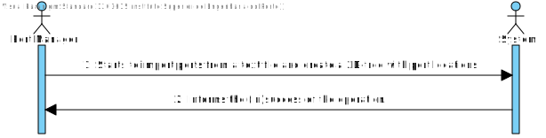
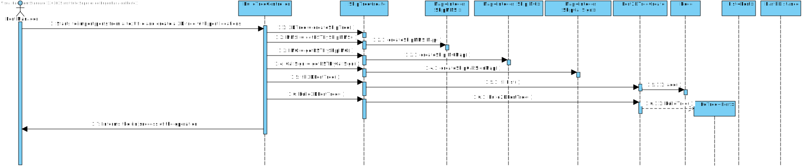
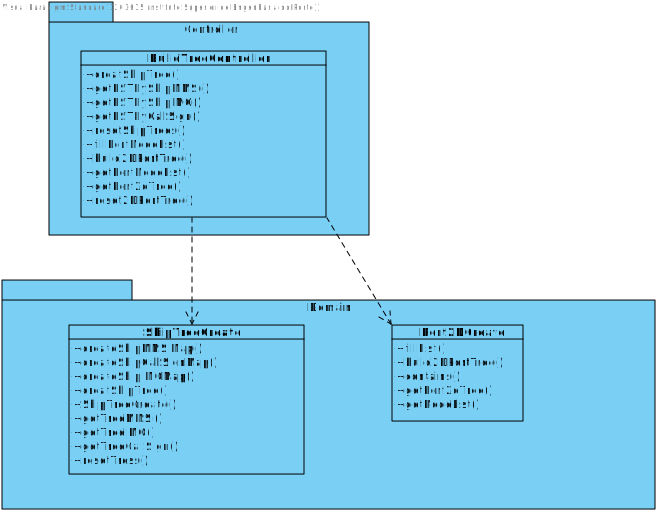
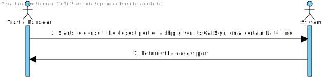
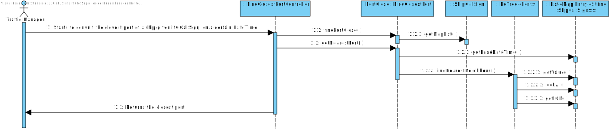
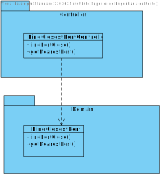

#ALL USER STORIES

#US201-Import ports from a text file and create a 2D-Tree
## 1. Requirements Engineering

### 1.1. User Story Description
As a Port manager, I which to import ports from a text file and create a 2D-tree with port locations.
### 1.2. Acceptance Criteria

* **AC1:** 2D-tree balanced.

### System Sequence Diagram (SSD)

## Sequence Diagram (SD)

## Class Diagram (CD)

# 2. Tests

## Class Comparator2DTreeYTest

**Test to compare**

    @Test
    void compare() {
        List<Node<Port>> list = new LinkedList<>();
        Node<Port> n1 = new Node<>(new Port("Europe", "Cyprus", 10136, "Larnaca", 34.91666667, 33.65), 34.91666667, 33.65);
        Node<Port> n2 = new Node<>(new Port("Europe", "Malta", 10138, "Marsaxlokk", 35.84194, 14.54306), 35.84194, 14.54306);
        Node<Port> n3 = new Node<>(new Port("Europe", "Denmark", 10358, "Aarhus", 56.15, 10.21666667), 56.15, 10.21666667);
        Node<Port> n4 = new Node<>(new Port("Europe", "Denmark", 10563, "Copenhagen", 55.7, 12.61666667), 55.7, 12.61666667);
        Node<Port> n5 = new Node<>(new Port("America", "Peru", 10860, "Matarani", -17, -72.1), -17, -72.1);
        Node<Port> n6 = new Node<>(new Port("Europe", "Italy", 11174, "Genoa", 44.4, 8.933333333), 44.4, 8.933333333);

        list.add(n1);
        list.add(n2);
        list.add(n3);
        list.add(n4);
        list.add(n5);
        list.add(n6);

        List<Node<Port>> list1 = new LinkedList<>();
        list1.add(n5);
        list1.add(n1);
        list1.add(n2);
        list1.add(n6);
        list1.add(n4);
        list1.add(n3);
        list.sort(new Comparator2DTreeX<>());
        assertEquals(list1,list);
    }

## Class KdTreeTest
**Test to create the tree**

    @Test
    public void testBuildTree2() {
    List<Node<Object>> nodes = new ArrayList<>();

        nodes.add(node1);
        nodes.add(node2);
        nodes.add(node3);
        nodes.add(node4);
        nodes.add(node5);

        KdTree<Object> tree = new KdTree<>();
        tree.buildTree(nodes);
        assertEquals(5, tree.getSize());

    }

# 3. Construction (Implementation)

## Class Port2DTreeCreate

    public class Port2DTreeCreate {

    private KdTree<Port> port2dTree;
    public List<Node<Port>> nodeList;

    public Port2DTreeCreate() {
        nodeList = new LinkedList<>();
        port2dTree = new KdTree<>();
    }

    public void fillList(Port port) {
        Node<Port> node = new Node<>(port, port.getLat(), port.getLon());
        nodeList.add(node);
    }

    public void build2DPortTree() {
        port2dTree.buildTree(getNodeList());
        if (port2dTree.getAll().size() != getNodeList().size()) {
            List<Node<Port>> list = new LinkedList<>();
            for (Node<Port> n : getNodeList()) {
                if (!contains(n.getObject().getCode(),port2dTree.getAll())){
                    list.add(n);
                }
            }
            for (Node<Port> n :list) {
                port2dTree.insertOrUpdate(n.getObject(),n.getObject().getLat(),n.getObject().getLon());
            }
        }
    }

    public boolean contains(int code, List<Port> list) {
        for (Port p : list) {
            if (p.getCode() == code) {
                return true;
            }
        }
        return false;
    }

    public KdTree<Port> getPort2dTree() {
        return port2dTree;
    }

    public void reset2DPortTree() {
        port2dTree = new KdTree<>();
        nodeList = new LinkedList<>();
    }

    public List<Node<Port>> getNodeList() {
        return nodeList;
    }
    }

# US 202 - Find the closest port of a ship with the CallSign, on a certain dateTime

## 1. Requirements Engineering

### 1.1. User Story Description

As a Traffic manager, I which to find the closest port of a ship given its CallSign, on a certain DateTime.

### 1.2. Acceptance Criteria

* **AC1:** using 2D-tree to find closest port.

### System Sequence Diagram (SSD)

## Sequence Diagram (SD)

## Class Diagram (CD)

# 2. Tests

## Class FindClosestPortTest
**Test to get the closest port to a ship chosen by its callSign, for both small and big files**

     @Test
     void getNearestPort() throws ParseException {
        readFilesController.load();
        if (!ReadFilesController.isUseBigFiles()) {
            Port p = new Port("America", "Colombia", 28313, "Cartagena", 10.417, -75.533);
            Ship ship1 = new Ship(212180000, new SimpleDateFormat("dd/MM/yyyy HH:mm").parse("31/12/2020 19:37"), 24.34573, -85.12394, 11.7, 119.9, 117, "SAITA I", "IMO9643544", "5BBA4", 70, 228, 32, 14.4, 0, "A");
            ShipCallSign shipCallSign = new ShipCallSign(ship1);
            Map<String, ShipCallSign> map = new HashMap<>();
            map.put("5BBA4", shipCallSign);
            List<Map.Entry<String, ShipCallSign>> groupedList = new LinkedList<>(map.entrySet());
        assertEquals(p, findClosestPort.getNearestPort(BuildTreeController.getInstance().getPort2dTree(), groupedList, "5BBA4", new SimpleDateFormat("dd/MM/yyyy HH:mm").parse("31/12/2020 19:37")));
         }else{
            Port p = new Port("America", "United States", 14635, "Los Angeles", 33.717, -118.267);
            Ship ship1 = new Ship(211331640,new SimpleDateFormat("dd/MM/yyyy HH:mm").parse("31/12/2020 01:25"),36.39094,-122.71335,19.7,145.5,147,"SEOUL EXPRESS","IMO9193305","DHBN",70,294,32,13.6,79,"B");
            ShipCallSign shipCallSign = new ShipCallSign(ship1);
            Map<String, ShipCallSign> map = new HashMap<>();
            map.put("DHBN", shipCallSign);
            List<Map.Entry<String, ShipCallSign>> groupedList = new LinkedList<>(map.entrySet());
         assertEquals(p, findClosestPort.getNearestPort(BuildTreeController.getInstance().getPort2dTree(), groupedList, "DHBN", new SimpleDateFormat("dd/MM/yyyy HH:mm").parse("31/12/2020 01:25")));
        }
    }

# 3. Construction (Implementation)

## Class FindClosestPort
    public class FindClosestPort {

    public Port findPortClose(KdTree<Port> ports, String shipCallSign, BST<ShipCallSign> treeCallSign, Date baseDateTime) {
    return getNearestPort(ports, treeCallSign.find(new ShipCallSign(shipCallSign)).getMapList(), shipCallSign, baseDateTime);
    }

    public Port getNearestPort(KdTree<Port> ports, List<Map.Entry<String, ShipCallSign>> list, String shipCallSign, Date baseDateTime) {
        for (Map.Entry<String, ShipCallSign> l : list) {
            if (l.getKey().equals(shipCallSign)) {
                if (l.getValue().getBaseDateTime().equals(baseDateTime)) {
                return ports.findNearestNeighbour(l.getValue().getlAT(), l.getValue().getlON());
                 }
             }
         }
        return null;
        }
    }

     
     
   
     
     
   